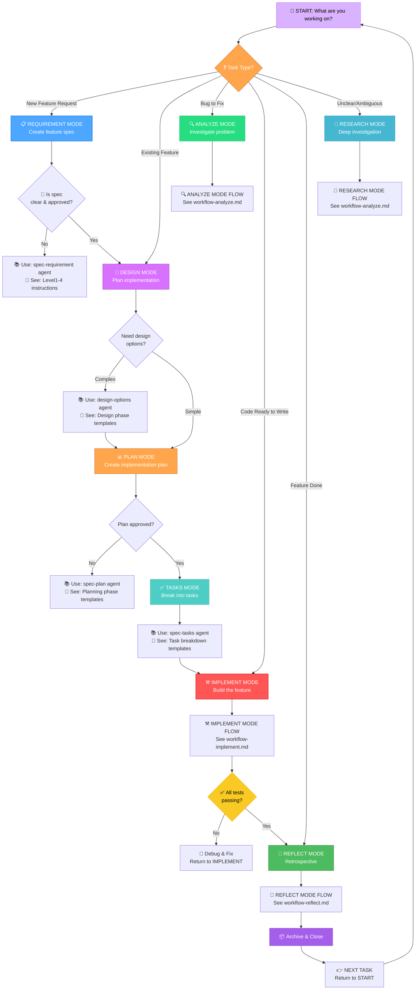

# Mode Discovery: Choose Your Workflow Path

**Purpose**: Determine which workflow mode to enter based on your current task

---

## Visual Flowchart



---

## Mode Selection Guide

### 📋 When to Enter REQUIREMENT Mode
- **Trigger**: New feature request or user story
- **Pre-requisites**: Feature idea exists
- **Duration**: 45-90 minutes
- **Output**: `spec.md` with requirement traceability
- **Next Step**: → DESIGN or PLAN mode

**Use if**:
- ✅ Feature is new and not yet specified
- ✅ Requirements are vague or need clarification
- ✅ Multiple stakeholders need alignment

---

### 🎨 When to Enter DESIGN Mode
- **Trigger**: Spec approved, need design decisions
- **Pre-requisites**: Approved spec exists
- **Duration**: 1-3 hours (simple) or 4-8 hours (complex)
- **Output**: `design.md` with architecture/options
- **Next Step**: → PLAN mode

**Use if**:
- ✅ Complex feature with multiple design options
- ✅ Architectural decisions needed upfront
- ✅ Team wants to see trade-offs before implementing

**Skip if**:
- ❌ Simple feature (go direct to PLAN)
- ❌ Design already decided
- ❌ Time-critical bug fix

---

### 🔍 When to Enter ANALYZE Mode
- **Trigger**: Bug report or need to investigate problem
- **Pre-requisites**: Problem statement
- **Duration**: 30-120 minutes
- **Output**: Analysis document in `artifacts/analytics/`
- **Next Step**: → REQUIREMENT or PLAN mode (depending on findings)

**Use if**:
- ✅ Root cause unknown
- ✅ Requirements vague ("fix the bug")
- ✅ Need to research alternatives
- ✅ Strategic decision needed

---

### 📊 When to Enter PLAN Mode
- **Trigger**: Spec + Design approved, ready to plan implementation
- **Pre-requisites**: Spec (design optional)
- **Duration**: 1-2 hours
- **Output**: `plan.md` with phased approach
- **Next Step**: → TASKS mode

**Use if**:
- ✅ Requirements clear and approved
- ✅ Need to break into phases
- ✅ Dependencies or risks need mapping

---

### ✅ When to Enter TASKS Mode
- **Trigger**: Plan approved, ready for implementation
- **Pre-requisites**: Spec + Plan
- **Duration**: 1-2 hours
- **Output**: `tasks.md` with checkboxes
- **Next Step**: → IMPLEMENT mode

**Use if**:
- ✅ Plan is detailed enough to break into tasks
- ✅ Team needs task checklist for tracking

---

### ⚒️ When to Enter IMPLEMENT Mode
- **Trigger**: Tasks defined, ready to code
- **Pre-requisites**: Spec + Plan + Tasks
- **Duration**: Varies (4 hours to 2+ weeks)
- **Output**: Code + tests
- **Next Step**: → REFLECT mode

**Use if**:
- ✅ All decisions made
- ✅ Ready to write code
- ✅ Tests are possible

---

### 🤔 When to Enter REFLECT Mode
- **Trigger**: Implementation complete, all tests passing
- **Pre-requisites**: Feature implemented + tested
- **Duration**: 30-60 minutes
- **Output**: `reflection.md` + archive
- **Next Step**: → START (next feature)

**Use if**:
- ✅ Feature complete and tested
- ✅ Ready to document lessons learned
- ✅ Want to improve process for next feature

---

## Decision Matrix: Which Mode Now?

| Current State     | What You Have           | Next Mode     | Duration      |
| ----------------- | ----------------------- | ------------- | ------------- |
| Feature request   | Vague idea              | 📋 REQUIREMENT | 1 hr          |
| Approved spec     | Clear requirements      | 🎨 DESIGN      | 1-3 hrs       |
| Need alternatives | Ambiguous problem       | 🔍 ANALYZE     | 1-2 hrs       |
| Approved design   | Architecture clear      | 📊 PLAN        | 1-2 hrs       |
| Approved plan     | Implementation strategy | ✅ TASKS       | 1-2 hrs       |
| Task list ready   | Checklist defined       | ⚒️ IMPLEMENT   | 4 hrs - 2 wks |
| Tests passing     | Feature done            | 🤔 REFLECT     | 30 mins       |

---

## Key Decision Points

### "Should I do DESIGN or go straight to PLAN?"

```
Feature Complexity?
├── Simple (add field, fix button) → Skip DESIGN, go to PLAN
├── Medium (new component, workflow) → Do DESIGN if team consensus needed
└── Complex (system redesign, data migration) → Always do DESIGN
```

### "Is my spec ready for PLAN?"

```
Checklist:
[ ] Problem statement clear
[ ] Acceptance criteria specific
[ ] Risks documented
[ ] Out-of-scope marked
[ ] Team approved

If all YES → Ready for PLAN
If any NO  → Return to REQUIREMENT
```

### "Can I skip straight to IMPLEMENT?"

```
ONLY IF:
[ ] Spec approved by team
[ ] Design documented (if complex)
[ ] Plan reviewed
[ ] All tasks defined
[ ] All prerequisites have sign-off

If all YES → Go to IMPLEMENT
If any NO  → Don't skip steps
```

---

## Mode Entry Points

| Entry Point       | Command           | Next Steps                                       |
| ----------------- | ----------------- | ------------------------------------------------ |
| New feature       | `/spec "feature"` | REQUIREMENT → DESIGN → PLAN → TASKS → IMPLEMENT  |
| Bug investigation | `/analyze "bug"`  | ANALYZE → usually REQUIREMENT → PLAN → IMPLEMENT |
| Ready to code     | `/plan`           | PLAN → TASKS → IMPLEMENT                         |
| Feature done      | `/reflect`        | REFLECT → Archive → Next feature                 |
| Just reviewing    | `/review`         | Review without mode change                       |

---

## Troubleshooting: "Where Should I Be?"

### "I'm starting a new feature"
→ Start at **REQUIREMENT** mode
→ Use `/spec` command

### "I have a bug to fix"
→ Start at **ANALYZE** mode (or skip to IMPLEMENT if obvious)
→ Use `/analyze` command

### "I have a spec and need to implement"
→ Start at **PLAN** mode
→ Use `/plan` command

### "I finished the code"
→ Go to **REFLECT** mode
→ Use `/reflect` command

### "I'm not sure what to do"
→ This flowchart is your guide
→ Answer: "What do I have right now?" → follow the path

---

## Related Workflows

See detailed flowcharts for each mode:
- 📍 [workflow-analyze.md](workflow-analyze.md) — Deep dive into ANALYZE
- 🎨 [workflow-design.md](workflow-design.md) — Deep dive into DESIGN
- 📊 [workflow-plan.md](workflow-plan.md) — Deep dive into PLAN
- ⚒️ [workflow-implement.md](workflow-implement.md) — Deep dive into IMPLEMENT
- 🤔 [workflow-reflect.md](workflow-reflect.md) — Deep dive into REFLECT
