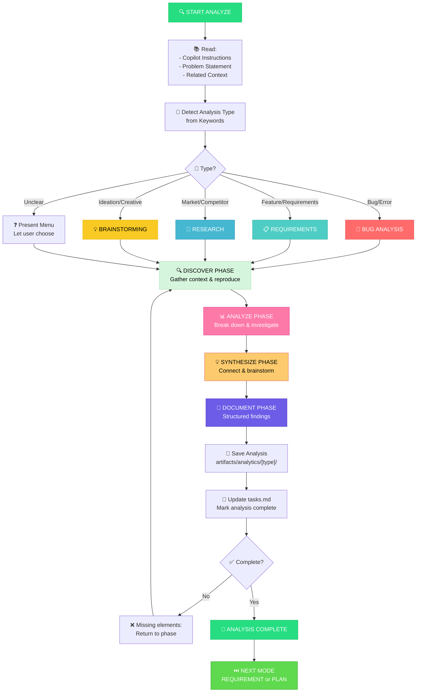

# ANALYZE Workflow: Investigation & Problem Solving

**Purpose**: Systematic investigation of problems, bugs, requirements, or research needs

**Duration**: 30 minutes to 2 hours
**Complexity**: Adapts to Level 1-4
**Output**: Analysis document in `artifacts/analytics/`

---

## Visual Flowchart



---

## 4-Phase Analysis Process

### Phase 1: DISCOVER 🔍
**Goal**: Gather information, context, and background

**What to do**:
- Collect relevant information
- Identify stakeholders
- Define scope and boundaries
- Gather background data
- Understand current state

**Questions to answer**:
- What's the problem?
- Who is affected?
- What's the context?
- What constraints exist?
- What data is available?

**Duration**: 10-30 minutes

---

### Phase 2: ANALYZE 📊
**Goal**: Break down problems, identify patterns, investigate deeply

**What to do**:
- Decompose into components
- Identify root causes
- Find patterns
- Analyze relationships
- Compare current vs desired state

**Questions to answer**:
- Why is this happening?
- What are the root causes?
- What patterns exist?
- What are the dependencies?
- What are the options?

**Duration**: 15-45 minutes

---

### Phase 3: SYNTHESIZE 💡
**Goal**: Connect insights, brainstorm solutions, create recommendations

**What to do**:
- Connect findings from analysis
- Generate potential solutions
- Evaluate options
- Prioritize approaches
- Create actionable recommendations

**Questions to answer**:
- What are possible solutions?
- What are the trade-offs?
- What's the best approach?
- What are the next steps?
- What needs decision?

**Duration**: 10-30 minutes

---

### Phase 4: DOCUMENT 📝
**Goal**: Create structured documentation for handoff

**What to do**:
- Create final analysis document
- Structure findings for easy consumption
- Include clear next steps
- Save to appropriate folder
- Update task tracking

**Files to create**:
- `analytics-[type]-[description].md` in artifacts/analytics/[type]/

**Duration**: 10-20 minutes

---

## Analysis Types

### 🐛 Bug Analysis
When to use: Error, crash, malfunction, unexpected behavior

**Template sections**:
- Problem Overview
- Reproduction Steps (can I make it happen again?)
- Current Behavior vs Expected
- Root Cause Analysis
- Solution Options
- Recommended Fix
- Prevention Measures

**Example outcome**:
"Token expiry bug caused by timezone conversion not accounting for daylight savings. Recommend centralizing time handling to UTC."

---

### 📋 Requirements/PRD Analysis
When to use: Feature request, specification, user story, product definition

**Template sections**:
- Requirements Gathering
- Stakeholder Analysis
- User Personas & Needs
- Feature Breakdown
- Success Criteria
- Implementation Recommendations
- Risks & Constraints

**Example outcome**:
"Dark mode feature should allow user-level preference, system preference detection, and scheduled switching. Affects 23 components across UI."

---

### 🔬 Research Analysis
When to use: Market research, competitor analysis, technology evaluation, strategy study

**Template sections**:
- Research Questions
- Information Gathering
- Competitive Analysis
- Market Insights
- Benchmark Findings
- Strategic Recommendations
- Action Items

**Example outcome**:
"3 competitors use JWT + Redis. Our custom token approach is 15% slower but more flexible. Recommend hybrid approach."

---

### 💡 Brainstorming Analysis
When to use: Ideation, creative exploration, problem-solving, innovation session

**Template sections**:
- Problem Definition
- Idea Generation (no filtering)
- Concept Evaluation
- Solution Prioritization
- Next Steps
- Decision Needed

**Example outcome**:
"5 UI concepts explored. Concept C best balances simplicity (score: 8/10) with feature completeness (score: 7/10). Recommend prototyping."

---

## Complexity Levels (Analysis Depth)

### Level 1: Quick Analysis (15 min)
- Single issue investigation
- Obvious root cause
- Minimal research needed
- Example: "Button not working → CSS class missing"

### Level 2: Standard Analysis (30-45 min)
- Multi-step investigation
- Some research needed
- Clear problem statement
- Example: "Performance slow → Database query optimization needed"

### Level 3: Comprehensive Analysis (1-2 hours)
- Complex investigation
- Multiple data sources
- Stakeholder interviews
- Example: "Auth system redesign → Market research + user interviews"

### Level 4: Deep Investigation (2+ hours)
- Significant research
- Multiple perspectives
- Strategic implications
- Example: "Technology stack evaluation → Competitive analysis + benchmarking + cost modeling"

---

## Analytics Folder Structure

Analysis documents saved to `artifacts/analytics/` organized by type:

```
artifacts/analytics/
├── requirements/                               # Feature specs, PRDs, user stories
│   ├── analysis-requirements-dark-mode.md
│   └── analysis-requirements-auth-sso.md
│
├── research/                                   # Market research, competitor analysis
│   ├── research-ai-frameworks-2026.md
│   └── research-deployment-strategies.md
│
├── bugs/                                       # Root cause investigation, incident reports
│   ├── investigation-token-expiry-bug.md
│   └── incident-database-timeout.md
│
└── brainstorming/                              # Ideation sessions, concept exploration
    ├── brainstorm-ui-redesign.md
    └── brainstorm-performance-optimization.md
```

**File naming**: `analytics-[type]-[brief-description].md`

---

## Completion Checklist

```
✅ ANALYZE MODE COMPLETION

[ ] Document type detected? (Bug/Requirement/Research/Brainstorm)
[ ] Appropriate template loaded?
[ ] All 4 phases completed? (DISCOVER → ANALYZE → SYNTHESIZE → DOCUMENT)
[ ] Analysis document saved to correct folder?
[ ] Naming convention followed? (analytics-[type]-[description])
[ ] Key insights documented and actionable?
[ ] Next steps clearly identified?
[ ] tasks.md updated with analysis status?

→ If all YES: Ready for NEXT MODE (usually REQUIREMENT or PLAN)
→ If any NO:  Return to missing phase
```

---

## Mode Transitions

### After Analysis Complete

**If investigating a BUG:**
```
ANALYZE → PLAN (implement fix directly)
or
ANALYZE → REQUIREMENT (if significant change needed)
```

**If analyzing REQUIREMENTS:**
```
ANALYZE → REQUIREMENT (create formal spec)
or
ANALYZE → DESIGN (if design complexity revealed)
```

**If conducting RESEARCH:**
```
ANALYZE → REQUIREMENT (use research to inform spec)
or
ANALYZE → PLAN (if decision is strategic planning)
```

**If BRAINSTORMING:**
```
ANALYZE → DESIGN (implement selected concept)
or
ANALYZE → REQUIREMENT (formalize chosen idea)
```

---

## Tips & Best Practices

### ✅ DO
- ✅ Take time to gather complete information before analyzing
- ✅ Document assumptions as you go
- ✅ Generate multiple options before choosing
- ✅ Include concrete examples in your document
- ✅ Identify what's uncertain
- ✅ Get stakeholder input early

### ❌ DON'T
- ❌ Rush to conclusions without investigation
- ❌ Skip the brainstorm/option generation phase
- ❌ Forget to document why (not just what)
- ❌ Leave ambiguity in final document
- ❌ Skip saving to standard location

---

## Troubleshooting

### "I don't know what type of analysis this is"
→ Menu will be presented to choose (Bug/Requirement/Research/Brainstorm)

### "Analysis feels incomplete"
→ Check the 4 phases: DISCOVER, ANALYZE, SYNTHESIZE, DOCUMENT
→ Return to incomplete phase before finishing

### "I need more research time"
→ Stay in ANALYZE - no time pressure
→ Can take 30 min or 3 hours, whatever needed

### "Results are unclear"
→ Go back to SYNTHESIZE phase
→ Revisit assumptions in ANALYZE phase
→ Gather more info in DISCOVER phase

---

## Related Workflows

- [mode-discovery.md](mode-discovery.md) — How to choose this mode
- [workflow-design.md](workflow-design.md) — After analysis, often move to DESIGN
- [workflow-plan.md](workflow-plan.md) — After analysis, often move to PLAN
