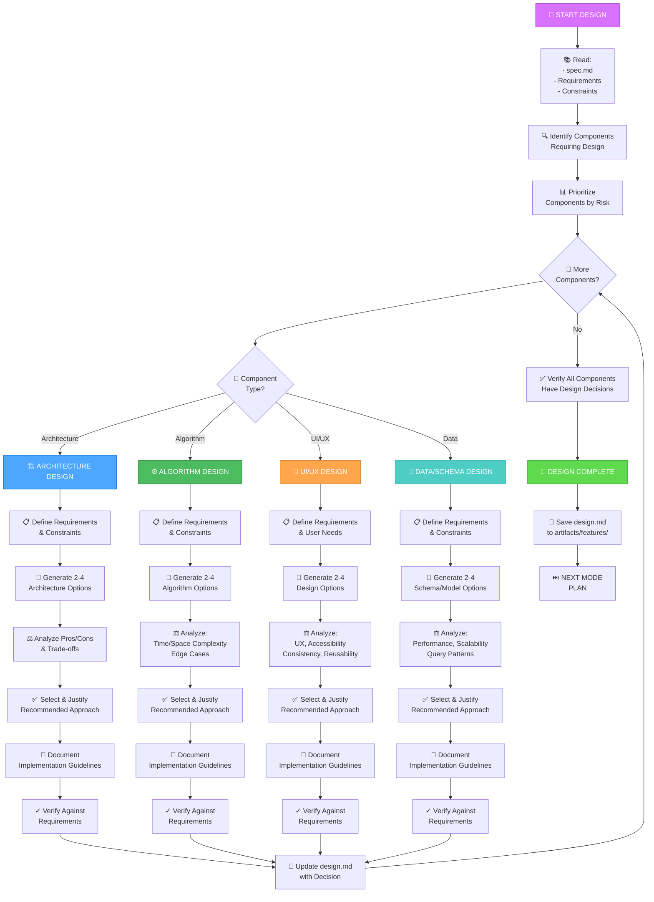

# DESIGN Workflow: Architecture & Design Decisions

**Purpose**: Make informed design decisions by exploring options, analyzing trade-offs, and justifying choices

**Duration**: 1-8 hours (depends on complexity)
**Complexity**: Level 2-4
**Output**: `design.md` with options and recommendations

---

## Visual Flowchart



---

## 4 Design Types

### 🏗️ Architecture Design
**When to use**: System structure, component relationships, service boundaries, integration patterns

**Process**:
1. Define requirements & constraints
2. Generate 2-4 architecture options
3. Analyze pros/cons of each:
   - Scalability
   - Complexity
   - Performance
   - Maintainability
   - Team capability
4. Select & justify best option
5. Document implementation plan

**Example**:
```
Component: User Authentication System

Option 1: Centralized Auth Service
✅ Single source of truth
✅ Easier to audit
❌ Creates bottleneck
❌ Single point of failure

Option 2: Federated Auth
✅ Scales independently
✅ Resilient
❌ Consistency harder
❌ More complex

❌ RECOMMENDED: Option 1 (Centralized)
Justification: Audit requirements mandate single source of truth
Cost of bottleneck acceptable at scale we project
```

---

### ⚙️ Algorithm Design
**When to use**: Complex algorithms, performance-critical operations, data processing

**Process**:
1. Define requirements & constraints
2. Generate 2-4 algorithm options
3. Analyze complexity:
   - Time complexity (Big O)
   - Space complexity
   - Edge case handling
   - Scalability limits
4. Select & justify
5. Document with pseudocode

**Example**:
```
Component: User Search

Option 1: Linear Scan
- Time: O(n), Space: O(1)
✅ Simple, no prep
❌ Slow for large datasets

Option 2: Database Index
- Time: O(log n), Space: O(n)
✅ Fast queries
❌ Index maintenance cost

Option 3: Full-text Search (Elasticsearch)
- Time: O(log n), Space: O(n)
✅ Fast, complex queries
❌ Added infrastructure

✅ RECOMMENDED: Option 3 (Full-text)
Justification: User expects complex search at scale
Infrastructure justified by 10x faster performance
```

---

### 🎨 UI/UX Design
**When to use**: User interfaces, workflows, interactions, visual design

**Process**:
1. Define user needs & constraints
2. Generate 2-4 design options
3. Analyze each for:
   - User experience (is it intuitive?)
   - Accessibility (can everyone use it?)
   - Pattern consistency (does it match other parts of app?)
   - Component reusability
4. Select & justify
5. Document with wireframes/mockups

**Example**:
```
Component: Dark Mode Toggle

Option 1: Settings Page Only
✅ Clear location
❌ Takes 3 clicks to toggle
❌ Users expect quick access

Option 2: Navbar Icon
✅ 1-click access
❌ Navbar already crowded
❌ Not obvious to new users

Option 3: System Preference Auto-detection
✅ Seamless UX
❌ Users can't easily override
❌ No visible toggle

✅ RECOMMENDED: Option 2 + 3 Hybrid
Justification: Auto-detect system preference, provide navbar toggle for manual override
Best balance of UX and accessibility
```

---

### 💾 Data/Schema Design
**When to use**: Database schemas, data models, API contracts, data flow

**Process**:
1. Define requirements & constraints
2. Generate 2-4 schema options
3. Analyze each for:
   - Query performance
   - Scalability
   - Data consistency
   - Update efficiency
4. Select & justify
5. Document schema

**Example**:
```
Component: User Preferences Storage

Option 1: Single Preferences Column (JSON)
✅ Simple, flexible
❌ Query overhead
❌ No type safety

Option 2: Separate Columns per Preference
✅ Fast queries, type safe
❌ Rigid schema
❌ Migration overhead for new preferences

Option 3: Key-Value Table
✅ Flexible, queryable
✅ Easy to add preferences
❌ More joins needed

✅ RECOMMENDED: Option 3 (Key-Value)
Justification: Balance between flexibility and query performance
Allows features team to add preferences without schema migrations
```

---

## Design Documentation Template

For each component, document:

```
🎨🎨🎨 ENTERING DESIGN PHASE: [COMPONENT]

## Component Description
What is this component? What problem does it solve?

## Requirements & Constraints
What must this component satisfy?
- Functional (what it does)
- Non-functional (performance, scalability, security)
- Technical constraints
- Team constraints

## Option 1: [Name]
**Description**: How this approach works

**Pros**:
- Benefit 1
- Benefit 2

**Cons**:
- Drawback 1
- Drawback 2

**Trade-offs**:
- You gain X but lose Y

---

## Option 2: [Name]
[Same structure]

---

## Option 3: [Name]
[Same structure]

---

## 🎯 RECOMMENDED: Option X

**Justification**:
Why this option best meets requirements.
What trade-offs do we accept?
Why is this optimal for our situation?

**Implementation Guidelines**:
How to implement this choice.
Key decisions that follow from this approach.

## ✅ Verification

Does solution meet all requirements? YES/NO
Are we comfortable with trade-offs? YES/NO

🎨🎨🎨 EXITING DESIGN PHASE
```

---

## Complexity Levels

### Level 2: Simple Component Design (1-2 hours)
- Single option obvious
- No major trade-offs
- Well-established patterns
- Example: "Button styling for dark mode"

### Level 3: Complex Component Design (2-4 hours)
- Multiple options with trade-offs
- Team discussion needed
- Some architectural impact
- Example: "Authentication flow architecture"

### Level 4: System-Level Design (4-8 hours)
- Multiple options with significant trade-offs
- Strategic decisions
- Cross-team impact
- Multiple design reviews
- Example: "Data storage approach (SQL vs NoSQL vs hybrid)"

---

## Design Output: design.md

Structure of design.md:
```
# Design Document: [Feature Name]

## Overview
Brief summary of design decisions

## Components Addressed
1. Component A - see Option 1 above
2. Component B - see Option 1 above
...

## Design Trade-offs
Summary of all trade-offs accepted

## Implementation Notes
What implementers need to know

## Future Considerations
What might change, what's extensible
```

---

## Completion Checklist

```
✅ DESIGN MODE COMPLETION

[ ] All flagged components addressed?
[ ] Multiple options explored for each?
[ ] Pros and cons analyzed?
[ ] Recommendations justified?
[ ] Implementation guidelines provided?
[ ] Design decisions documented?
[ ] design.md created in correct location?

→ If all YES: Ready for PLAN mode
→ If any NO:  Return to incomplete component
```

---

## Tips & Best Practices

### ✅ DO
- ✅ Generate options even if one seems obvious
- ✅ Document "why not" for rejected options
- ✅ Get diverse perspectives on trade-offs
- ✅ Think about edge cases and scalability
- ✅ Consider team capability and experience

### ❌ DON'T
- ❌ Rush to implementation
- ❌ Ignore constraints
- ❌ Skip analyzing trade-offs
- ❌ Premature optimization
- ❌ Design in a vacuum

---

## Mode Transitions

### After Design Complete
```
DESIGN → PLAN (create implementation strategy)
```

If design reveals spec gaps:
```
DESIGN → REQUIREMENT (clarify ambiguity)
→ Back to DESIGN (with clarified spec)
```

---

## Related Workflows

- [mode-discovery.md](mode-discovery.md) — How to choose this mode
- [workflow-plan.md](workflow-plan.md) — After DESIGN, move to PLAN
- [workflow-implement.md](workflow-implement.md) — After PLAN, move to IMPLEMENT
