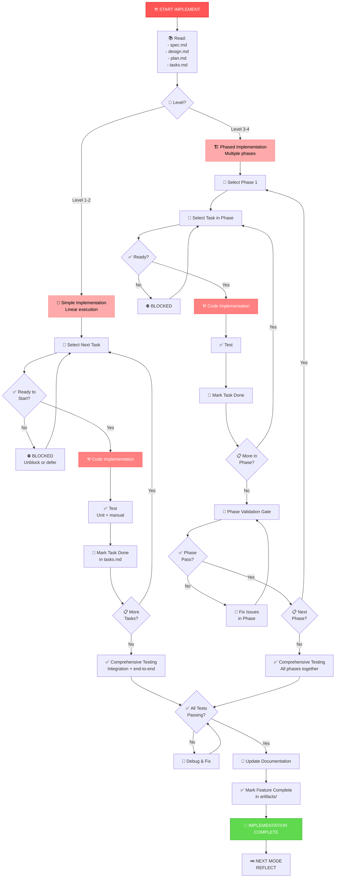

# IMPLEMENT Workflow: Building the Feature

**Purpose**: Execute implementation according to plan, maintain traceability, test thoroughly

**Duration**: Varies by complexity (4 hours to 2+ weeks)
**Complexity**: Level 1-4
**Output**: Code + tests + working feature

---

## Visual Flowchart



---

## Implementation Approaches by Complexity

### Level 1: Quick Bug Fix (1-4 hours)

**Approach**:
1. Understand bug (reproduce it)
2. Locate problem area
3. Implement targeted fix
4. Test fix thoroughly
5. Verify no regressions

**Best practices**:
```
1. Read bug description carefully
2. Create minimal reproduction case
3. Examine relevant code
4. Make minimal fix (don't refactor while fixing)
5. Add test that would catch this bug
6. Verify existing tests still pass
```

**Example**:
```
Bug: "Login button disabled after first attempt"

1. Reproduce: Clear cache → try login twice → button stuck disabled
2. Find: loginButtonRef.disable = true never reset to false
3. Fix: Add reset in success/error handlers
4. Test: Try success path → button re-enables ✓
5. Test: Try error path → button re-enables ✓
6. Test: Existing login tests still pass ✓
```

---

### Level 2: Simple Enhancement (4-12 hours)

**Approach**:
1. Read plan
2. Follow implementation sequence
3. Implement each component
4. Test each component
5. Integration test
6. Final verification

**Best practices**:
```
1. Follow plan order (dependencies first)
2. Work on one component at a time
3. Test immediately after each component
4. Mark tasks done as you go
5. Keep commits small and traceable
```

**Example**:
```
Feature: Add company field to profile

1. Database: Add company_name column
   - Write migration
   - Test migration up/down ✓

2. API: Add company_name to endpoints
   - Add parameter
   - Test endpoint ✓

3. UI: Add company input field
   - Create component
   - Test rendering ✓

4. Integration: Test full flow
   - Fill field → see saved
   - Edit field → change saves ✓
```

---

### Level 3-4: Phased Implementation (multiple days/weeks)

**Approach by Phase**:

**Phase 1: Core Functionality**
- Build essential components
- Get basic flow working
- Validation gate: Core works, tests pass

**Phase 2: Integration**
- Connect components
- Handle edge cases
- Validation gate: Full workflow works, no errors

**Phase 3: Polish**
- Performance optimization
- Error messages
- Visual polish
- Validation gate: Ready for production

**Working example**:
```
Feature: Dark Mode System (Level 4)

PHASE 1: Core Engine
- Create theme provider
- Create CSS modules
- Store preference locally
→ Gate: Themes switch, preference persists ✓

PHASE 2: Component Updates
- Update all 40+ components
- Test each with both themes
→ Gate: All styled, no console errors ✓

PHASE 3: Polish
- Add transitions
- System preference detection
- Mobile optimization
→ Gate: Smooth animations, mobile works ✓
```

---

## Implementation Workflow

### Before Starting Any Task

```
CHECKLIST:
[ ] Read spec.md (what are we building?)
[ ] Understand acceptance criteria
[ ] Read plan.md (how to do it?)
[ ] Understand dependencies
[ ] Check tasks.md (what's the order?)
[ ] Know what blocked means (other tasks? infrastructure?)
```

### For Each Task

```
1. MARK TASK: "In Progress" in tasks.md
2. IMPLEMENT: Write code
3. TEST: Write & run tests
4. MARK TASK: "Done" when tests pass
5. COMMIT: Reference task ID in commit message
   Example: "TASK-023: Add JWT validation"
```

### Traceability: Spec → Code → Tests

```
Spec: REQ-FN-003: "Generate time-limited reset token"
      AC-001: "Token valid for exactly 15 minutes"

Plan: "Implement token module with expiry logic"

Task: TASK-023: "Create password reset token schema"

Code: // Create token with 15-minute expiry
      token.expiry = Date.now() + (15 * 60 * 1000)

Test: describe("Token Expiry", () => {
        it("AC-001: Token expires after 15 minutes", () => {
          // Test that token is invalid after 15 min
        })
      })
```

### Level 1-2: Linear Execution

```
for each task in order:
  - read task description
  - understand dependencies
  - implement
  - test immediately
  - mark done
  - commit with task ref
```

### Level 3-4: Phased Execution

```
for each phase:
  for each task in phase order:
    - implement
    - test
    - mark done

  phase validation gate:
    - run all tests
    - manual verification
    - if gate fails: fix issues
```

---

## Testing Requirements

### For Every Task

```
At minimum:
[ ] Unit tests written (or updated)
[ ] Manual test of your change
[ ] Ran existing test suite
[ ] No new console errors
[ ] Acceptance criteria verified
```

### Test Pyramid

```
For Level 1-2: Mostly unit + manual
For Level 3-4: Unit + integration + manual + end-to-end
```

### Test Coverage Targets

```
Level 1: 50%+ coverage (simple fixes)
Level 2: 70%+ coverage (enhancements)
Level 3: 80%+ coverage (features)
Level 4: 90%+ coverage (critical systems)
```

---

## Debugging When Stuck

If stuck on a task:

```
1. UNDERSTAND: Reread task + spec
2. RESEARCH: Look at similar code
3. EXPERIMENT: Try small changes
4. TEST: Verify hypothesis
5. ASK: Pair with someone
6. DOCUMENT: Mark as blocked with reason
7. MOVE ON: Defer if others depend on you
```

---

## Code Quality Checklist

```
[ ] Follows code style from constitution.md
[ ] No console.log() left in code
[ ] Error handling present
[ ] Comments for non-obvious code
[ ] Indentation consistent
[ ] No commented-out code
[ ] Variable names clear
[ ] Functions < 50 lines
[ ] Classes < 200 lines
```

---

## Documentation While Coding

Update as you implement:

```
README.md:
- Add new installation steps if needed
- Document new features
- Add usage examples

Code comments:
- Why you did something (not what)
- Complex logic explained
- Edge cases noted

Commit messages:
- Reference task ID
- One line summary
- Detailed description if needed

tasks.md:
- Mark tasks done immediately
- Note any blockers
- Flag issues for next phase
```

---

## Completion Checklist

```
✅ IMPLEMENTATION COMPLETION

[ ] All tasks marked done in tasks.md?
[ ] All acceptance criteria met?
[ ] All tests passing?
[ ] Code reviewed (at least by your pair)?
[ ] Documentation updated?
[ ] No console errors?
[ ] Manual verification complete?
[ ] Deployment/rollback plan understood?

→ If all YES: Ready for REFLECT mode
→ If any NO:  Complete missing items
```

---

## Tips & Best Practices

### ✅ DO
- ✅ Test after every component
- ✅ Commit frequently with clear messages
- ✅ Keep changes small and focused
- ✅ Read error messages carefully
- ✅ Pair on difficult parts
- ✅ Take breaks if frustrated

### ❌ DON'T
- ❌ Skip testing to "save time"
- ❌ Refactor while fixing bugs
- ❌ Ignore compiler warnings
- ❌ Add features not in spec
- ❌ Leave debug code in commits
- ❌ Push untested code

---

## Mode Transitions

### After Implementation Complete
```
IMPLEMENT → REFLECT (retrospective)
```

If bugs found during testing:
```
IMPLEMENT → Debug & fix → Back to testing
```

If spec ambiguity found:
```
IMPLEMENT → REQUIREMENT (clarify)
→ Back to IMPLEMENT
```

---

## Related Workflows

- [mode-discovery.md](mode-discovery.md) — How to choose this mode
- [workflow-plan.md](workflow-plan.md) — May need to revisit plan
- [workflow-reflect.md](workflow-reflect.md) — After implementation complete
