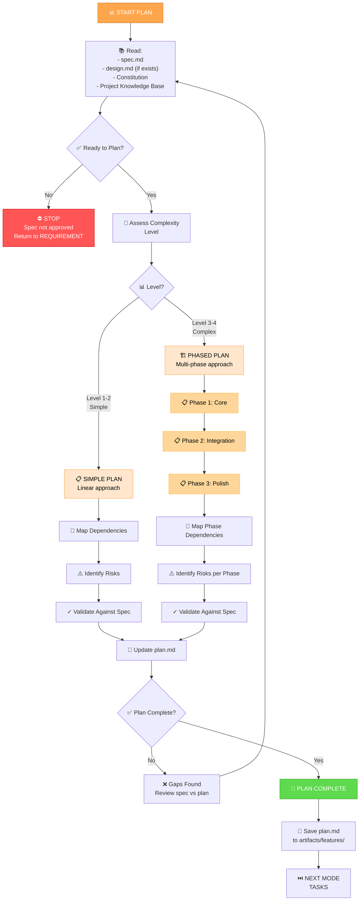

# PLAN Workflow: Implementation Strategy

**Purpose**: Create detailed implementation plan that breaks approved spec into structured phases

**Duration**: 1-2 hours
**Complexity**: Level 1-4
**Output**: `plan.md` with phased approach and dependencies

---

## Visual Flowchart



---

## Planning Approaches by Complexity

### Level 1-2: Simple Linear Planning (30-45 min)

**For**: Quick fixes, simple enhancements, uncomplicated features

**Approach**:
1. Map dependencies
2. Identify risks
3. Define validation approach
4. Create sequential task list

**Plan structure**:
```
## Overview
Summary of what's changing

## Changes
- File 1: What's changing
- File 2: What's changing

## Dependencies
- None (for simple changes)
- Or: Service X must be ready first

## Risks
- Risk: Impact if happens
- Mitigation: How to prevent/handle

## Validation
- Test 1: Verify spec requirement
- Test 2: Verify spec requirement

## Timeline
Estimated 4-8 hours
```

**Example**: Add new form field
```
## Overview
Add optional "company" field to user profile

## Changes
- Auth schema: add company_name column
- Profile API: add company_name parameter
- UI: add company input field

## Dependencies
- Database migration must run first

## Risks
- Field name could conflict: use snake_case to avoid
- Null values must be handled: default to null

## Validation
- API accepts/returns company_name
- Field visible on profile page
- Null values don't cause errors
```

---

### Level 3-4: Phased Planning (1-2 hours)

**For**: Complex features, multiple components, architectural changes

**Approach**:
1. Break into logical phases
2. Define phase dependencies
3. Identify phase-specific risks
4. Define validation gates per phase

**Plan structure**:
```
## Overview
What's the big picture?

## Architecture
How will it be built?

## Phase 1: [Core Functionality]
### Goal
### Components
### Changes
### Validation Gate
### Timeline

## Phase 2: [Integration]
### Goal
### Dependencies on Phase 1
### Components
### Changes
### Validation Gate
### Timeline

## Phase 3: [Polish]
### Goal
### Components
### Changes
### Validation Gate
### Timeline

## Overall Timeline
Total estimate

## Risks & Mitigations
Per-phase risks

## Rollback Strategy
How to revert if needed
```

**Example**: Dark mode feature
```
## Phase 1: Core Dark Mode Engine
- Create theme provider
- Create dark CSS module
- Store user preference
- Validation Gate: Theme switches, preference saves

## Phase 2: UI Component Updates
- Update all components for dark mode
- Test all themes
- Validation Gate: All components styled, no console errors

## Phase 3: Polish & Edge Cases
- System preference detection
- Transitions between themes
- Mobile optimization
- Validation Gate: Mobile works, transitions smooth
```

---

## Planning Template

### Section 1: Overview
Concise description of what's being built and why it matters.

**Questions to answer**:
- What problem does this solve?
- Who benefits?
- What's the user impact?

### Section 2: Requirements Summary
Key requirements this plan must satisfy.

**What to include**:
- Functional requirements (what it does)
- Non-functional (performance, scalability)
- Constraints (tech, team, time)

### Section 3: Architecture/Approach
How will it be built?

**What to include**:
- High-level approach
- Major components
- Integration points
- Technology decisions

### Section 4: Phased Breakdown (if Level 3-4)

**For each phase**:
- Phase name & goal
- Components affected
- Changes required
- Testing/validation gates
- Dependencies on previous phases
- Timeline estimate

### Section 5: Dependencies & Sequencing

**Map**:
- What must happen first
- What can be parallel
- External dependencies
- Team dependencies

### Section 6: Risks & Mitigations

**For each risk**:
- What could go wrong?
- How likely (H/M/L)?
- What's the impact?
- How to prevent/mitigate?

### Section 7: Validation & Testing Strategy

**Define**:
- Unit tests needed
- Integration tests
- Manual verification
- Success criteria
- Performance targets

### Section 8: Rollback Strategy (if complex)

**Cover**:
- If Phase 1 fails: revert to what?
- Rollback commands
- Data implications

---

## Complexity Level Detection

### Level 1: Quick Bug Fix
✅ Do PLAN if:
- Needs sequence definition
- Multiple files affected

❌ Skip PLAN if:
- Single file change
- Obvious fix

### Level 2: Simple Enhancement
✅ Always do PLAN because:
- Multiple components likely
- Dependencies possible
- Clear sequence important

### Level 3: Complex Feature
✅ Always do PLAN because:
- Phased approach needed
- Interdependencies
- Validation gates important

### Level 4: System/Architecture
✅ Always do PLAN because:
- Multiple phases required
- Major dependencies
- Rollback strategy critical

---

## Validation Checklist

```
✅ PLAN COMPLETION CHECKLIST

[ ] Aligned with approved spec?
[ ] Reflects design decisions (if Level 3-4)?
[ ] All components identified?
[ ] Dependencies clearly mapped?
[ ] Timeline realistic?
[ ] Risks identified & mitigated?
[ ] Validation approach clear?
[ ] For phased plans: gates defined per phase?
[ ] Rollback strategy defined (if critical)?
[ ] Constitution requirements met?
[ ] Project knowledge base patterns followed?

→ If all YES: Ready for TASKS mode
→ If any NO:  Review gap to resolve
```

---

## Tips & Best Practices

### ✅ DO
- ✅ Be realistic about estimates
- ✅ Break into phases for large features
- ✅ Define clear validation gates
- ✅ Think about order of work
- ✅ Consider team capability
- ✅ Anticipate problems

### ❌ DON'T
- ❌ Skip dependencies
- ❌ Underestimate complexity
- ❌ Plan without considering risks
- ❌ Make it too prescriptive
- ❌ Ignore team constraints

---

## Mode Transitions

### After Plan Complete
```
PLAN → TASKS (break into actionable tasks)
```

If planning reveals gaps:
```
PLAN → DESIGN (clarify design)
or
PLAN → REQUIREMENT (clarify spec)
→ Back to PLAN
```

---

## Related Workflows

- [mode-discovery.md](mode-discovery.md) — How to choose this mode
- [workflow-design.md](workflow-design.md) — May need to revisit design
- [workflow-implement.md](workflow-implement.md) — After TASKS, move to IMPLEMENT
