# REFLECT Workflow: Retrospective & Closure

**Purpose**: Review completed work, capture lessons learned, archive documentation

**Duration**: 30-60 minutes (reflection) + 15 min (archiving)
**Complexity**: Level 1-4
**Output**: `reflection.md` + archived feature + knowledge gained

---

## Visual Flowchart

```mermaid
graph TD
    Start["🤔 START REFLECT"] --> ReadDocs["📚 Read:<br/>- spec.md<br/>- plan.md<br/>- tasks.md<br/>- Implementation"]

    ReadDocs --> ReviewImpl["🔍 REFLECTION PHASE<br/>Review completed work"]

    ReviewImpl --> ReviewSuccess["👍 Document Successes<br/>What went well?"]
    ReviewSuccess --> ReviewChallenge["👎 Document Challenges<br/>What was hard?"]
    ReviewChallenge --> ReviewLessons["💡 Document Lessons<br/>What did we learn?"]
    ReviewLessons --> ReviewProcess["📈 Document Process<br/>Improvements"]
    ReviewProcess --> ReviewDecisions["📋 Document Decisions<br/>Made vs planned"]

    ReviewDecisions --> CreateReflection["📝 Create reflection.md<br/>Structured document"]
    CreateReflection --> UpdateTasks["📝 Update tasks.md<br/>Mark as reflected"]
    UpdateTasks --> ReflectComplete["🏁 REFLECTION COMPLETE"]

    ReflectComplete --> PromptArchive["💬 Ready to archive?<br/>Type ARCHIVE NOW"]
    PromptArchive --> UserCommand{"⌨️ User<br/>Command?"}

    UserCommand -->|"ARCHIVE NOW"| ArchivePhase["📦 ARCHIVING PHASE<br/>Triggered by user"]
    UserCommand -->|"Wait/Edit"| EditReflect["✏️ Edit reflection.md<br/>Refine findings"]
    EditReflect --> PromptArchive

    ArchivePhase --> VerifyReflect{"✅ Reflection<br/>Complete?"}
    VerifyReflect -->|"No"| RedoReflect["⛔ Return to Reflection<br/>Complete missing sections"]
    RedoReflect --> ReviewImpl
    VerifyReflect -->|"Yes"| CreateArchive["📦 Create Archive<br/>docs/archive/[date]-[feature]/"]

    CreateArchive --> CopyFiles["📋 Copy to archive:<br/>- spec.md<br/>- plan.md<br/>- tasks.md<br/>- reflection.md"]
    CopyFiles --> UpdateMemory["🧠 Update project memory:<br/>- Patterns discovered<br/>- Gotchas found<br/>- Solutions documented"]
    UpdateMemory --> MarkComplete["✅ Mark Feature COMPLETE<br/>in tasks.md"]
    MarkComplete --> UpdateProgress["📊 Update progress.md<br/>Archive link + summary"]
    UpdateProgress --> ArchiveComplete["🏁 ARCHIVING COMPLETE"]

    ArchiveComplete --> Summary["📊 Summary<br/>- What was built<br/>- Key learnings<br/>- Recommendations"]
    Summary --> NextTask["👉 READY FOR NEXT TASK"]

    style Start fill:#4dbb5f,stroke:#36873f,color:white
    style ReviewImpl fill:#d6f5dd,stroke:#a3e0ae,color:black
    style ReflectComplete fill:#4dbb5f,stroke:#36873f,color:white
    style ArchivePhase fill:#4da6ff,stroke:#0066cc,color:white
    style ArchiveComplete fill:#4da6ff,stroke:#0066cc,color:white
    style NextTask fill:#5fd94d,stroke:#3da336,color:white
    style RedoReflect fill:#ff5555,stroke:#cc0000,color:white
```



---

## Reflection Phase: 5 Questions to Answer

### 1. 👍 What Went Well?

**Document**:
- Successes (things that turned out great)
- Team achievements
- Technical victories
- Process wins
- What should we repeat?

**Examples**:
```
✅ Early design exploration prevented 2 architecture rewrites
✅ Pair programming caught 3 bugs before testing
✅ Clear spec meant no scope creep
✅ Good test coverage made refactoring safe
✅ Regular check-ins kept us aligned
```

**Positive tone**: Celebrate wins, even small ones

---

### 2. 👎 What Was Challenging?

**Document**:
- Obstacles faced
- Unexpected complexity
- Technical debt encountered
- Process pain points
- Team challenges

**Examples**:
```
⚠️ Database migration took 3x longer than expected
⚠️ API rate limiting caused integration test failures
⚠️ CSS compatibility issues across browsers
⚠️ Communication gap between frontend/backend
⚠️ Unfamiliar library had steep learning curve
```

**Neutral tone**: Problems are learning opportunities

---

### 3. 💡 Lessons Learned?

**Document**:
- Key insights
- "Next time" thoughts
- Pattern recognition
- New techniques discovered
- Anti-patterns to avoid

**Examples**:
```
💡 Migrating data before code causes test failures - do code first
💡 CSS Grid is faster than Flexbox for this use case
💡 Small, focused pull requests = faster reviews
💡 Integration tests need test data fixtures setup
💡 Real users think about UX differently than we do
```

**Actionable tone**: Extract learnings others can use

---

### 4. 📈 Process Improvements?

**Document**:
- What should we do differently next time?
- Process changes to experiment with
- Tool improvements
- Workflow optimizations
- Team improvements

**Examples**:
```
📈 Start design reviews earlier in process
📈 Set up integration testing environment sooner
📈 Create reusable component templates for common patterns
📈 Use feature flags for safer deployments
📈 Document API contracts upfront to catch mismatches
```

**Future-focused tone**: How to be better next time

---

### 5. 📋 Decisions Made vs Planned

**Document**:
- Major decisions made during implementation
- Why we deviated (if we did)
- Trade-offs accepted
- Assumptions that changed

**Examples**:
```
📋 PLANNED: Use React hooks
    ACTUAL: Hooks were overkill, used classes instead
    WHY: Simpler codebase, team more familiar with classes

📋 PLANNED: Complete in 2 weeks
    ACTUAL: Took 3 weeks
    WHY: Underestimated API integration complexity

📋 PLANNED: 80% test coverage
    ACTUAL: 92% achieved
    WHY: Pair programming + early TDD found edge cases
```

---

## Reflection Document Template

### Structure of reflection.md

```markdown
# Reflection: [Feature Name]

**Date**: [When completed]
**Duration**: [Actual time vs planned]
**Team**: [Who worked on this]

---

## What Went Well ✅

[Successes, achievements, good decisions]

### Team Wins
- Win 1
- Win 2

### Technical Wins
- Win 1
- Win 2

### Process Wins
- Win 1

---

## Challenges Encountered ⚠️

[Obstacles, complexity, pain points]

### Technical Challenges
- Challenge + solution
- Challenge + solution

### Process Challenges
- Challenge + solution

### Team Challenges
- Challenge + solution

---

## Key Lessons Learned 💡

[Insights, patterns, techniques]

1. Lesson 1 - Why it matters
2. Lesson 2 - Why it matters
3. Lesson 3 - Why it matters

---

## Process Improvements for Next Time 📈

[What to do differently]

| Area          | Current          | Improvement            |
| ------------- | ---------------- | ---------------------- |
| Design        | No design review | Add design review gate |
| Testing       | Late in cycle    | Start earlier          |
| Communication | Weekly syncs     | Daily standups         |

---

## Decisions Made 📋

### Planned vs Actual

| Decision     | Planned       | Actual   | Reason                  |
| ------------ | ------------- | -------- | ----------------------- |
| Architecture | Microservices | Monolith | Complexity too high     |
| Timeline     | 2 weeks       | 3 weeks  | Underestimated API work |

---

## By the Numbers 📊

- **Actual Time**: 40 hours (vs 32 planned)
- **Tests Written**: 47 (vs 30 planned)
- **Code Review Cycles**: 5 (vs 3 planned)
- **Bugs Found in QA**: 3 (mostly edge cases)
- **Production Incidents**: 0

---

## Recommendations for Next Similar Feature 🎯

[Actionable recommendations]

1. Recommendation 1 - why it matters
2. Recommendation 2 - why it matters

---

## Knowledge Captured for Team Repository 🧠

[What should go into team memory]

- Pattern: [Pattern discovered]
- Gotcha: [Gotcha to avoid]
- Solution: [Reusable solution]

---

## Final Thoughts 🎉

[Team reflections, appreciation, growth noted]
```

---

## Archiving Phase: Preserving Knowledge

### What Gets Archived

```
docs/archive/2026-04-04-dark-mode/
├── spec.md              (what we built)
├── plan.md              (how we built it)
├── tasks.md             (what we did)
├── reflection.md        (what we learned)
└── README.md            (quick overview)
```

### Archive Location

```
docs/archive/[YYYY-MM-DD]-[feature-slug]/
Example: docs/archive/2026-04-04-dark-mode/
```

### What Gets Updated in Project Memory

```
memories/repo/
├── project-knowledge-base.md
│   → Add discovered patterns
│   → Add process improvements
│
├── legacy-system-watchouts.md
│   → Add gotchas found
│
└── integration-points.md
    → Add new integration learnings
```

---

## Reflection Checklist

### Before Creating reflection.md

```
✅ REVIEW CHECKLIST

[ ] Read specification - did we build it?
[ ] Read plan - did we follow it?
[ ] Reviewed all code changes
[ ] Verified all tests passing
[ ] Checked documentation is updated
[ ] Verified no known bugs
[ ] Performance meets expectations
[ ] Security review complete (if needed)
```

### For reflection.md Completion

```
✅ REFLECTION CHECKLIST

[ ] Successes clearly articulated?
[ ] Challenges honestly documented?
[ ] Lessons are specific (not vague)?
[ ] Process improvements actionable?
[ ] Decisions documented (planned vs actual)?
[ ] Numbers captured (time, tests, iterations)?
[ ] Recommendations clear?
[ ] Knowledge items identified for team memory?

→ If all YES: Ready for ARCHIVE NOW
→ If any NO:  Complete missing sections
```

### For Archiving

```
✅ ARCHIVING CHECKLIST

[ ] Archive folder created in docs/archive/
[ ] All 4 files copied to archive
[ ] tasks.md marked COMPLETE
[ ] progress.md updated with archive link
[ ] Patterns added to project knowledge base
[ ] Gotchas added to watchouts
[ ] Team memory updated
[ ] Feature removed from artifacts/features (archive complete)

→ If all YES: FEATURE COMPLETE
→ Ready for NEXT TASK
```

---

## Complexity Levels: Reflection Depth

### Level 1: Quick Reflection (15-20 min)
Quick retrospective on simple fix
- What went wrong?
- How'd we fix it?
- Prevention?

### Level 2: Standard Reflection (30-40 min)
Regular retrospective on enhancement
- What went well?
- What was hard?
- What'd we do differently?

### Level 3: Comprehensive Reflection (45-60 min)
Detailed retrospective on complex feature
- Full 5-question review
- Process analysis
- Team learnings
- Architecture insights

### Level 4: Deep Reflection (60+ min)
Strategic retrospective on system work
- Complete analysis of decisions
- Architectural evaluation
- Team growth assessment
- Future strategy implications

---

## Tips & Best Practices

### ✅ DO
- ✅ Be honest about challenges
- ✅ Celebrate wins specifically
- ✅ Extract general lessons (not just specific)
- ✅ Get team input on reflection
- ✅ Document decisions while fresh
- ✅ Create actionable improvements

### ❌ DON'T
- ❌ Skip reflection to "save time"
- ❌ Be overly critical
- ❌ Make reflection feel like blame
- ❌ Leave lessons vague ("communicate better")
- ❌ Forget to celebrate wins
- ❌ Lose knowledge capture to chaos

---

## Sample Reflection: Dark Mode Feature

```markdown
# Reflection: Dark Mode Implementation

**Duration**: 40 hours actual (vs 32 planned)
**Team**: Alice, Bob, Carol

## What Went Well ✅

### Team Wins
- Early prototyping prevented 2 major UI issues
- Pair programming between frontend/backend caught 3 bugs

### Technical Wins
- CSS variable approach proved very flexible
- Component testing setup makes regression testing safe

## Challenges ⚠️

### Technical
- System preference detection took 6 hours (estimated 2)
- Mobile theme transitions needed 3 iterations

### Process
- Missing test data fixtures slowed integration testing

## Lessons 💡

1. **Theme variables should be defined early** - defining late forced refactoring
2. **Mobile needs separate theme consideration** - wasn't obvious in design
3. **System preference is more complex than it seems** - timezone + user overrides

## Improvements 📈

| Area          | This Time              | Next Time                 |
| ------------- | ---------------------- | ------------------------- |
| Testing       | Added tests after code | Write tests first         |
| Communication | Weekly syncs           | Daily standups on UI work |
| Design        | No design review       | Add design review gate    |

## Numbers 📊

- Actual: 40 hrs (125% of estimate)
- Tests: 52 (vs 30 planned)
- Review cycles: 6 (vs 3 planned)
- Bugs in QA: 2
- Production incidents: 0

## Recommendations 🎯

1. **Use CSS variables from the start** - more flexible than expected
2. **Account for system preferences in design phase** - complex integration
3. **Mobile theming needs specialized testing** - separate testing approach

## Knowledge for Team 🧠

✅ Pattern: "CSS variable theme system"
✅ Gotcha: "System preference + user override = complex logic"
✅ Solution: "UserPreference entity for preferences, hooks for theme context"
```

---

## Mode Transitions

### After Reflection Complete
```
REFLECT → ARCHIVE (when user says "ARCHIVE NOW")
     ↓
Feature Complete
     ↓
Return to START for next feature
```

---

## Related Workflows

- [mode-discovery.md](mode-discovery.md) — Back to START for next feature
- [workflow-implement.md](workflow-implement.md) — What we're reflecting on
- [workflow-plan.md](workflow-plan.md) — Plan we followed
