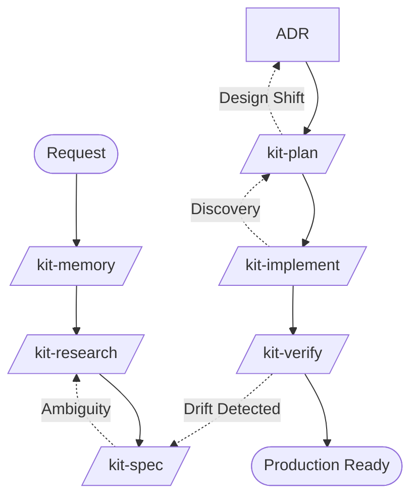

# AI Agents Development Kit

[](https://github.com/thaihai-swe/ai-agents-dev-kit/actions)
[](https://creativecommons.org/publicdomain/zero/1.0/)

**Durable, Spec-Anchored Development for AI Coding Agents.**

The AI Agents Development Kit is a professional framework for running **Spec-Driven Development (SDD)**. It moves beyond "vibe coding" by treating structured specifications, technical plans, and task lists as the primary source of truth for AI agents.

## 🚀 Why This Kit?

Most AI agents drift during implementation because their only context is the current codebase and a vague chat history. This kit enforces **Spec-Anchoring**:
- **Eliminate Ambiguity:** Mandatory Socratic waves ensure requirements are clear before a single line of code is written.
- **Enforce Traceability:** Every task and test traces back to a specific requirement.
- **Prevent Drift:** Automated checks ensure the implementation never diverges from the approved specification.

---

## 🛠 The 8-Skill Workflow

The kit consolidates engineering steps into 8 core "Phase Owners" to minimize agent friction while maintaining maximum rigor.



| Skill | Role | Artifacts |
| :--- | :--- | :--- |
| **`/kit-memory`** | **Context** | `memories/repo/constitution.md`, `memories/repo/project-knowledge-base.md` |
| **`/kit-research`** | **Investigate** | `artifacts/features/<slug>/analysis.md` |
| **`/kit-spec`** | **Define** | `spec.md`, `requirements-review.md` |
| **`/kit-adr`** | **Decide** | `adr-[number].md`, `adr-log.md` |
| **`/kit-plan`** | **Engineer** | `design.md`, `plan.md`, `tasks.md` |
| **`/kit-implement`** | **Execute** | Code + Test Changes |
| **`/kit-verify`** | **Validate** | `review.md`, `testing-scenarios.md` |
| **`/kit-cleanup`** | **Maintain** | Refactored Code |

---

## 🏁 Quick Start

### 1. Adopt the Kit
To install, copy or vendor the `skills/` directory into your target repository. Note: `bootstrap-kit.sh` does not copy `skills/` for you.

### 2. Initialize
```bash
bash scripts/bootstrap-kit.sh
```

### 3. Start a Feature
Ask your AI agent (Cursor, Claude Code, Gemini CLI):
> "Run /kit-spec for feature 'user-auth-fix'. Ask me 5 clarifying questions first."

---

## 📖 Choose Your Path

| I am a... | I want to... | Start Here |
| :--- | :--- | :--- |
| **New Developer** | Learn how to build a feature with the kit. | [Getting Started Tutorial](docs/getting-started.md) |
| **Architect** | Understand the design principles and data flow. | [Architecture & Design](docs/architecture.md) |
| **Contributor** | Extend the kit with new skills or templates. | [Contributor Guide](docs/contributing.md) |
| **Maintainer** | Run consistency checks and release updates. | [Maintainer Guide](docs/maintainers.md) |

---

## 🏛 License

This project is licensed under the [CC0 1.0 Universal](LICENSE) - see the [LICENSE](LICENSE) file for details.
