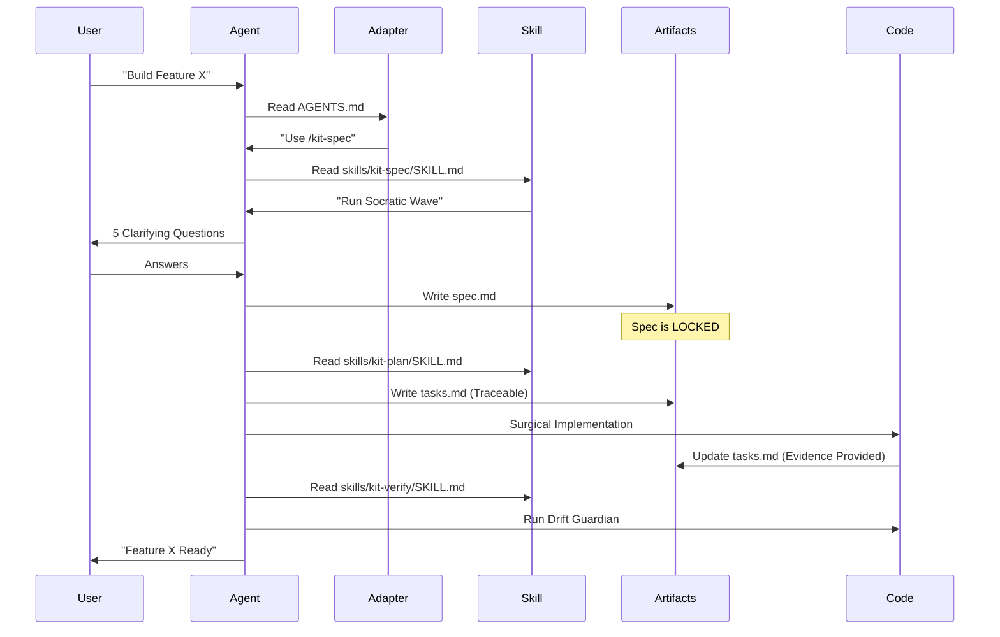

# Architecture & Design Principles

This guide explains the technical foundation of the AI Agents Development Kit and the four core principles that ensure engineering rigor.

---

## 1. The Three-Layer Architecture

The kit decouples workflow logic from AI clients while ensuring a durable, traceable state.

### A. The Skill Layer (Logic)
Located in `skills/`, this layer defines the **Engineering Contract**. Each skill tells an agent what to read, how to operate, and when to stop. This layer is the "Brain" of the workflow.

### B. The Adapter Layer (Entrypoints)
Located at the repo root (e.g., `AGENTS.md`), this is a **Thin Wrapper**. It tells the AI client where the skills live and enforces the "Skill-First" rule to prevent improvisation.

### C. The Artifact Layer (State)
Located in `artifacts/features/<slug>/`, this is the **Source of Truth**. It provides a durable, resumable record of every decision, surviving session resets and context window limits.

---

## 2. Core Design Principles

### 1. Artifact-First (Durable Memory)
**Rule:** If it isn't in the artifact, it didn't happen.
**Why:** Chat history is transient. Artifacts ensure that requirements, plans, and tasks are preserved for any agent or human to pick up.

### 2. Surgicality (Minimal Impact)
**Rule:** Every change must trace to a specific Task ID.
**Why:** Prevents "drive-by refactoring." Focused diffs are easier to review and safer for brownfield repositories.

### 3. Idempotency (Refinement over Replacement)
**Rule:** Skills must be safe to run multiple times on the same artifact.
**Why:** AI outputs vary. Idempotency allows the agent to refine and tighten documents without starting from scratch.

### 4. Evidence-Based Verification (Trust but Verify)
**Rule:** "Done" requires fresh evidence (logs, tests, proof).
**Why:** Eliminates "vibe coding." We judge success by observed results, not plausible-looking code.

---

## 3. Agentic Data Flow

---

## 4. Key Architectural Decisions (ADRs)

1.  **Markdown Over JSON:** Native optimization for AI reading/writing and human-readable reviews.
2.  **File-Based State:** Entire state lives in Git, enabling branching, versioning, and portability.
3.  **Decoupled Execution:** Skills define the "What" and "How," while the agent uses its own standard tools for execution.
