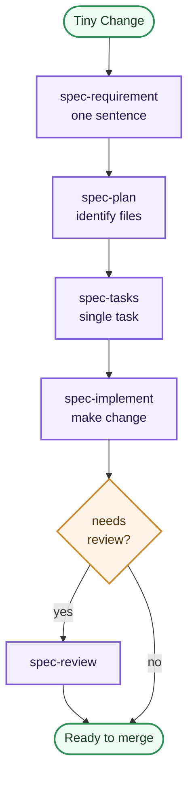

# Use Case Workflows

This page shows common entry paths through the kit, with concrete scenarios and decision trees for different team situations and change types.

**To understand how each stage works and why feedback loops occur,** see [Visual Workflow](visual-workflow.md). That page explains the full workflow diagram, stage responsibilities, and common looping scenarios with detailed reasoning.

## Repository Start Paths


### New Project Scenario

**When to use:** You're starting a greenfield project with a new team or fresh codebase.

**Path:** `/constitution` → `/project-knowledge-base` → first feature

**What happens:**
1. **Constitution** establishes team principles, coding standards, and architectural guidelines
2. **Project Knowledge Base** documents the project structure, critical decisions, and development patterns
3. Both become durable repo memory that all future features reference

**Example:** A startup building a SaaS product from scratch uses `/constitution` to define tech stack choices, naming conventions, and deployment patterns. Then `/project-knowledge-base` captures the initial API structure and data model decisions.

### Existing Project Scenario

**When to use:** You're adding features to an established repository with existing patterns and decisions.

**Path:** `/analyze` → `/project-knowledge-base` → first feature (optionally loop back to `/constitution` if rules are missing)

**What happens:**
1. **Analyze** surveys the existing codebase to identify patterns, gaps, and working practices
2. **Project Knowledge Base** either documents found patterns or flags where constitution rules should be created
3. Features then proceed with clearer context

**Example:** A team inheriting a 3-year-old Django app runs `/analyze` to understand authentication flows, database patterns, and API conventions. They update `/project-knowledge-base` with findings, and future features follow those patterns consistently.

## Feature Delivery Paths

```mermaid
flowchart TD
    Feature([Choose change type])
    NewFeature[New feature]
    Brownfield[Brownfield feature]
    BugFix[Bug fix]
    TinyChange[Tiny change]

    Analyze[analyze]
    Spec[spec-requirement]
    ReqReview[spec-review-requirements]
    Design[spec-design]
    Plan[spec-plan]
    Tasks[spec-tasks]
    Audit[/task-traceability-audit]
    Implement[spec-implement]
    Review[/spec-review]
    Testing[spec-testing-scenarios]
    Promote[/memory-promotion]

    Feature --> NewFeature --> Analyze
    Feature --> Brownfield --> Analyze
    Feature --> BugFix --> Analyze
    Feature --> TinyChange --> Spec

    Analyze --> Spec
    Spec --> ReqReview
    ReqReview -->|ready| Plan
    ReqReview -->|design needed| Design
    ReqReview -.->|not ready| Spec
    Design --> Plan
    Plan --> Tasks
    Tasks -.-> Audit
    Audit -.->|gaps found| Tasks
    Tasks --> Implement
    Implement --> Review
    Review -.->|changes required| Implement
    Review -.->|upstream issue| Plan
    Review --> Testing
    Analyze -.-> Promote
    Review -.-> Promote
    Design -.-> Promote

    classDef start fill:#fff6e8,stroke:#c98a2b,color:#4f3306,stroke-width:1px;
    classDef workflow fill:#f3efff,stroke:#7b5cd6,color:#26174a,stroke-width:1px;
    classDef helper fill:#eefbf2,stroke:#2f8f5b,color:#163a22,stroke-width:1px;

    class Feature,NewFeature,Brownfield,BugFix,TinyChange start;
    class Analyze,Spec,ReqReview,Design,Plan,Tasks,Implement,Review,Testing workflow;
    class Audit,Promote helper;
```

### New Feature Scenario

**When to use:** Building a feature that doesn't exist in the codebase yet and affects multiple systems or user paths.

**Path:** `/analyze` → `/spec-requirement` → `/spec-review-requirements` → `/spec-design` (if needed) → `/spec-plan` → `/spec-tasks` → `/spec-implement` → `/spec-review` → `/spec-testing-scenarios`

**Typical duration:** 2–4 weeks for a mid-sized feature

```mermaid
flowchart TD
    Start([New Feature]) --> Analyze[analyze]
    Analyze --> Spec[spec-requirement]
    Spec --> Review{spec-review<br/>ready?}
    Review -->|design needed| Design[spec-design]
    Design --> Plan[spec-plan]
    Review -->|yes| Plan
    Plan --> Tasks[spec-tasks]
    Tasks --> Implement[spec-implement]
    Implement --> CodeReview[/spec-review]
    CodeReview -->|approved| Testing[spec-testing<br/>-scenarios]
    CodeReview -->|needs changes| Implement
    Testing --> Done([Ready to merge])

    classDef start fill:#fff6e8,stroke:#c98a2b,color:#4f3306,stroke-width:2px;
    classDef process fill:#f3efff,stroke:#7b5cd6,color:#26174a,stroke-width:2px;
    classDef decision fill:#fef3e8,stroke:#c98a2b,color:#4f3306,stroke-width:2px;
    classDef done fill:#eefbf2,stroke:#2f8f5b,color:#163a22,stroke-width:2px;

    class Start,Done done;
    class Analyze,Spec,Plan,Tasks,Implement,CodeReview,Testing process;
    class Review,Design decision;
```

**Example:** Adding a payment processing system to an e-commerce app:
- **Analyze:** Check how the current checkout flow works, what payment libraries exist, and who owns billing logic
- **Spec:** Write requirements for Stripe integration, handling multiple payment methods, and refund workflows
- **Review:** Ensure requirements cover edge cases (declined cards, timeout handling, currency conversion)
- **Design:** Diagram the webhook handlers, database schema for transactions, and error recovery paths
- **Plan & Tasks:** Break into units: Stripe API setup, webhook service, retry logic, testing harness
- **Implement:** Code each task, linking commits to task IDs
- **Review:** Ensure all requirements are met, no payments are lost, security checks pass
- **Testing:** Verify declined cards, currency handling, partial refunds, and webhook recovery

### Brownfield Feature Scenario

**When to use:** Adding to or improving an existing feature area; the feature partially exists or touches established patterns.

**Path:** `/analyze` → `/spec-requirement` → `/spec-review-requirements` → optional `/spec-design` → `/spec-plan` → `/spec-tasks` → `/spec-implement` → `/spec-review` → `/spec-testing-scenarios`

**Typical duration:** 1–3 weeks

```mermaid
flowchart TD
    Start([Brownfield Feature]) --> Analyze[analyze<br/>existing code]
    Analyze --> Spec[spec-requirement<br/>build on patterns]
    Spec --> Review{needs new<br/>design?}
    Review -->|yes, complex| Design[spec-design]
    Review -->|no, follow existing| Plan[spec-plan]
    Design --> Plan
    Plan --> Tasks[spec-tasks]
    Tasks --> Implement[spec-implement]
    Implement --> CodeReview[/spec-review]
    CodeReview -->|approved| Testing[spec-testing<br/>-scenarios]
    CodeReview -->|needs changes| Implement
    Testing --> Done([Ready to merge])

    classDef start fill:#fff6e8,stroke:#c98a2b,color:#4f3306,stroke-width:2px;
    classDef process fill:#f3efff,stroke:#7b5cd6,color:#26174a,stroke-width:2px;
    classDef decision fill:#fef3e8,stroke:#c98a2b,color:#4f3306,stroke-width:2px;
    classDef done fill:#eefbf2,stroke:#2f8f5b,color:#163a22,stroke-width:2px;

    class Start,Done done;
    class Analyze,Spec,Plan,Tasks,Implement,CodeReview,Testing process;
    class Review,Design decision;
```

**Example:** Extending user authentication with multi-factor authentication (MFA):
- **Analyze:** How is current auth implemented? Where are login and session checks? What third-party libraries are in use?
- **Spec:** MFA requirement covers TOTP app support, SMS fallback, admin ability to disable MFA for users
- **Design:** Usually skipped or lightweight—build on existing auth patterns
- **Plan & Tasks:** Setup TOTP libraries, update login flow, add user settings page, backup codes
- **Implement & Review:** Ensure backward compatibility with existing non-MFA users; security review
- **Testing:** Test both TOTP and SMS paths, backup code recovery, forced re-enrollment

### Bug Fix Scenario

**When to use:** Fixing a defect with clear reproduction steps and a known impact.

**Path:** `/analyze` (understand root cause) → `/spec-requirement` (define the fix) → optional `/spec-design` → `/spec-plan` → `/spec-tasks` → `/spec-implement` → `/spec-review` → `/spec-testing-scenarios`

**Typical duration:** A few hours to 2 days

```mermaid
flowchart TD
    Start([Bug Fix]) --> Analyze[analyze<br/>root cause]
    Analyze --> Spec[spec-requirement<br/>define fix]
    Spec --> Design{complex<br/>fix?}
    Design -->|simple| Plan[spec-plan]
    Design -->|redesign needed| SpecDesign[spec-design]
    SpecDesign --> Plan
    Plan --> Tasks[spec-tasks]
    Tasks --> Implement[spec-implement]
    Implement --> CodeReview[/spec-review]
    CodeReview -->|approved| Testing[spec-testing<br/>-scenarios]
    CodeReview -->|needs changes| Implement
    Testing --> Done([Ready to merge])

    classDef start fill:#fff6e8,stroke:#c98a2b,color:#4f3306,stroke-width:2px;
    classDef process fill:#f3efff,stroke:#7b5cd6,color:#26174a,stroke-width:2px;
    classDef decision fill:#fef3e8,stroke:#c98a2b,color:#4f3306,stroke-width:2px;
    classDef done fill:#eefbf2,stroke:#2f8f5b,color:#163a22,stroke-width:2px;

    class Start,Done done;
    class Analyze,Spec,Plan,Tasks,Implement,CodeReview,Testing process;
    class Design,SpecDesign decision;
```

**Example:** Fixing a memory leak in the notification service:
- **Analyze:** Run profiler, identify the leaking resource, understand why the cleanup isn't firing
- **Spec:** Document the bug behavior and the desired fix (e.g., "listeners must be unsubscribed when the service shuts down")
- **Plan:** Identify all cleanup points
- **Implement:** Add the missing unsubscribe calls
- **Test:** Reproduce the original leak, verify it's gone, test under load
- **Promote:** If the fix reveals a general pattern, update `project-knowledge-base` for cleanup conventions

### Tiny Change Scenario

**When to use:** Small, low-risk changes: typo fixes, config tweaks, simple style improvements, or adding a single utility function.

**Path:** `/spec-requirement` → `/spec-plan` → `/spec-tasks` → `/spec-implement` → `/spec-review` (optional)

**Typical duration:** 15 minutes to 1 hour



**Example:** Changing the logo in the footer or renaming a constant
- **Spec:** One sentence: "Update footer logo to 2024 version" or "Rename `MAX_RETRIES` to `MAX_RETRY_ATTEMPTS` for clarity"
- **Plan:** Identify the file(s)
- **Tasks:** Single task
- **Implement:** Make the change
- **Review:** Quick visual check or grep to ensure all references updated

---

## Decision Tree: Which Path Applies?

| Scenario | Path | Rationale |
|----------|------|-----------|
| Fixing a typo in a comment | Tiny change → implement directly | No traceability required; low risk |
| Adding a new payment method to existing checkout | Brownfield -> `/analyze` -> `/spec-requirement` -> `/spec-implement` | Touches existing code; new variant of known pattern |
| Building a real-time collaboration feature | New feature -> `/analyze` -> `/spec-requirement` -> `/spec-design` -> `/spec-plan` | Complex, spans multiple teams, novel interaction patterns |
| Disabling a deprecated API endpoint | Tiny change -> `/spec-requirement` -> `/spec-implement` | Simple but should document deprecation reason |
| Fixing reported user auth timeout | Bug fix -> `/analyze` -> `/spec-requirement` -> `/spec-implement` -> `/spec-review` | Needs root cause and reproduction |
| Adding a new export format to reports | Brownfield -> `/analyze` -> `/spec-requirement` -> `/spec-implement` | Known report structure; new format variant |
| Updating npm dependencies | Tiny change -> `/spec-implement` -> `/spec-review` | Routine maintenance; check for breaking changes |
| Redesigning the admin dashboard | New feature -> `/analyze` -> `/spec-requirement` -> `/spec-design` -> `/spec-plan` | High visibility; needs design review and buy-in |

## Quick Reading Guide

- use the first diagram when deciding how to bootstrap the kit in a repository
- use the second diagram when deciding how much workflow a specific change needs
- `/memory-promotion` appears only when a local finding becomes durable repo knowledge (e.g., "we always use factory pattern for mocks")
- `/task-traceability-audit` is a quality check around task decomposition, not a mandatory step for every tiny change
- when in doubt between two paths, choose the more detailed one; the kit is built to skip steps if they add no value
