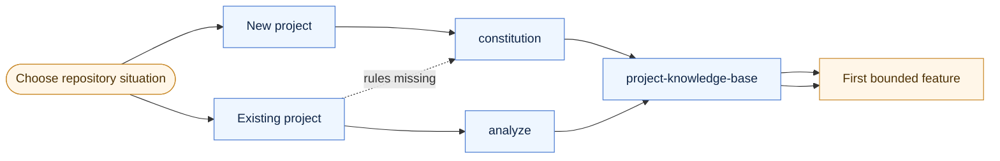
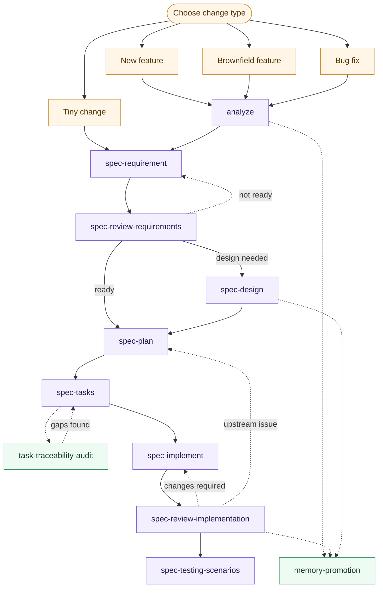

# Use Case Workflows

This page shows common entry paths through the kit.

## Repository Start Paths

## Feature Delivery Paths

## Quick Reading Guide

- use the first diagram when deciding how to bootstrap the kit in a repository
- use the second diagram when deciding how much workflow a specific change needs
- `memory-promotion` appears only when a local finding becomes durable repo knowledge
- `task-traceability-audit` is a quality check around task decomposition, not a mandatory step for every tiny change
