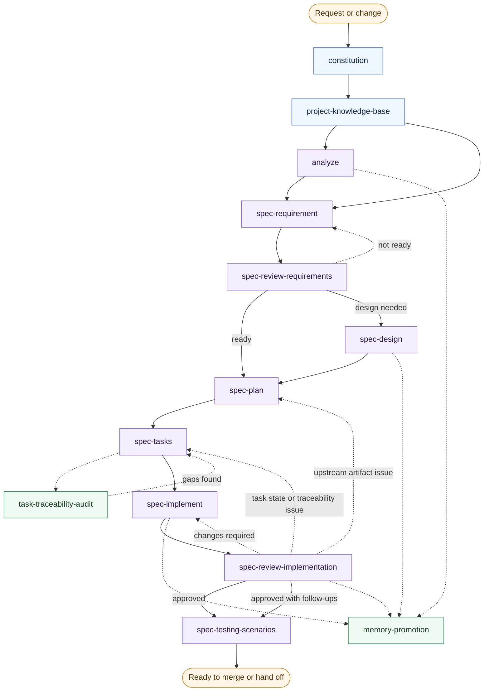

# Visual Workflow

This diagram shows the artifact-first workflow, including foundation skills, helper skills, and the main backward loops.

## Reading The Diagram

- solid arrows show the normal forward path
- dotted arrows show helper usage or backward movement when the current stage is blocked
- `constitution` and `project-knowledge-base` are foundation skills, not per-feature middle steps
- `memory-promotion` can happen after analysis, design, implementation, or review when a finding becomes durable repo memory
- `task-traceability-audit` is a helper check around task quality, not a replacement for planning or implementation
