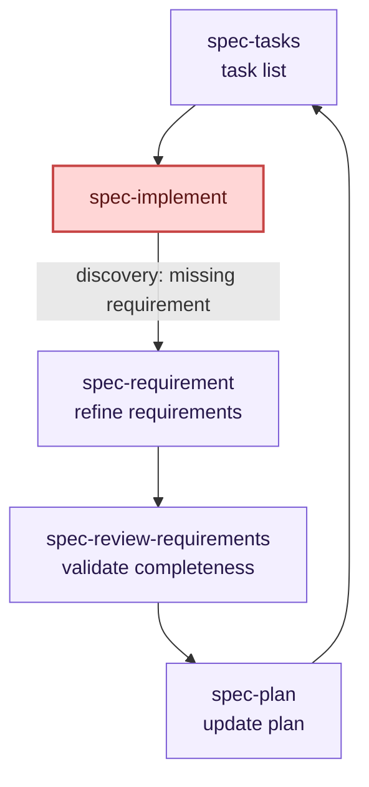

# Visual Workflow

This diagram shows the artifact-first workflow, including foundation skills, helper skills, and the main backward loops. Below the diagram are stage-by-stage explanations and common scenarios.

```mermaid
flowchart TD
    Start([Request or change])

    Constitution[/constitution]
    PKB[/project-knowledge-base]
    Analyze[/analyze]
    Spec[/spec-requirement]
    ReqReview[/spec-review-requirements]
    Design[/spec-design]
    Plan[/spec-plan]
    Tasks[/spec-tasks]
    Audit[/task-traceability-audit]
    Implement[/spec-implement]
    Review[/spec-review]
    Testing[/spec-testing-scenarios]
    Promote[/memory-promotion]
    Done([Ready to merge or hand off])

    Start --> Constitution
    Constitution --> PKB
    PKB --> Analyze
    PKB --> Spec
    Analyze --> Spec
    Spec --> ReqReview
    ReqReview -->|ready| Plan
    ReqReview -->|design needed| Design
    ReqReview -.->|not ready| Spec
    Design --> Plan
    Design -.-> Promote
    Plan --> Tasks
    Tasks -.-> Audit
    Audit -.->|gaps found| Tasks
    Tasks --> Implement
    Implement --> Review
    Implement -.-> Promote
    Review -->|approved| Testing
    Review -->|approved with follow-ups| Testing
    Review -.->|changes required| Implement
    Review -.->|task state or traceability issue| Tasks
    Review -.->|upstream artifact issue| Plan
    Testing --> Done
    Analyze -.-> Promote
    Review -.-> Promote

    classDef foundation fill:#eef6ff,stroke:#4a7bd1,color:#0f2547,stroke-width:1px;
    classDef workflow fill:#f3efff,stroke:#7b5cd6,color:#26174a,stroke-width:1px;
    classDef helper fill:#eefbf2,stroke:#2f8f5b,color:#163a22,stroke-width:1px;
    classDef outcome fill:#fff6e8,stroke:#c98a2b,color:#4f3306,stroke-width:1px;

    class Constitution,PKB foundation;
    class Analyze,Spec,ReqReview,Design,Plan,Tasks,Implement,Review,Testing workflow;
    class Audit,Promote helper;
    class Start,Done outcome;
```

## Stage-by-Stage Explanation

### Foundation Stages (Run once per repository)

#### Constitution
**Purpose:** Establish team principles, standards, and architectural rules.

**Artifacts produced:**
- Naming conventions (e.g., "tests live in `__tests__` folders")
- Coding standards (e.g., "use functional components, no class components")
- Deployment rules (e.g., "main branch auto-deploys to staging")
- Team agreements (e.g., "code review is mandatory before merge")

**When to revisit:** When team scale changes, or when patterns prove unworkable across projects.

**Example:** A Python team documents that all internal data is UTC, JSON fields use snake_case, and new code requires 80%+ test coverage.

#### Project Knowledge Base
**Purpose:** Document the specific repository's architecture, structure, and critical decisions.

**Artifacts produced:**
- Directory structure and what lives where
- How the build system works
- Authentication and authorization patterns in *this* codebase
- Common dependencies and why they're chosen
- Gotchas and anti-patterns specific to the project

**When to update:** After completing major features, or when `analyze` uncovers new patterns.

**Example:** "This Django project uses DRF for APIs. Serializers live in `api/serializers/`. All endpoints require API key auth except `/health`. Database migrations run automatically on deploy."

---

### Feature Planning Stages

#### Analyze
**Purpose:** Understand the existing codebase, patterns, and gaps relevant to the change.

**What to do:**
- Read the relevant source files
- Identify where the change touches the system
- Find similar patterns already in the codebase
- Spot missing documentation or inconsistent patterns
- Check for technology or library constraints

**Decision point:**
- If patterns exist and are clear -> proceed to `/spec-requirement`
- If patterns are inconsistent or unclear -> may feed back to `/constitution` or `/project-knowledge-base`

**Example:** Before building a new reporting feature, analyze how the existing dashboard fetches and caches data. Identify the ORM patterns, permission checks, and frontend state management.

#### Spec-Requirement
**Purpose:** Write *what* must be built, without prescribing *how*.

**Artifacts produced:**
- User stories or acceptance criteria
- Edge cases and error scenarios
- Performance or security constraints
- Success metrics (optional, but valuable)

**What good looks like:**
- "Users can download reports in CSV and Excel formats"
- "The system must handle >100k rows without timing out"
- "Admins can restrict report access by department"

**Decision point:**
- If requirements are clear and achievable -> `/spec-review-requirements`
- If requirements are vague or incomplete → loop back to refine

**Example:** "Payment webhook must retry failed notifications up to 3 times. Retry delay increases exponentially (1s, 4s, 16s). If all retries fail, alert ops via PagerDuty."

#### Spec-Review-Requirements
**Purpose:** Validate that requirements are complete, testable, and aligned with constraints.

**Review checklist:**
- Can a tester write test cases from these requirements?
- Are edge cases covered (timeouts, network failures, invalid input)?
- Do requirements conflict with existing patterns or limitations?
- Is there vendor lock-in or compliance burden?

**Decision points:**
- If requirements look ready -> proceed to `/spec-plan`
- If design complexity is high -> detour through `/spec-design`
- If requirements are incomplete -> loop back to refine in `/spec-requirement`

**Example:** "We can't handle >100k rows without rewriting the ORM layer. Let's scope that to a follow-up. For now, we'll add a warning at 50k rows and document the limit."

#### Spec-Design (Optional but Recommended for Complex Features)
**Purpose:** Sketch *how* the system will work before committing to tasks.

**Artifacts produced:**
- Data model diagrams
- API endpoint designs
- State machine diagrams (for complex flows)
- Error handling strategies
- Integration points with external systems

**What good looks like:**
- A diagram or pseudocode that a senior engineer nods at
- All major components identified
- Clear ownership of each piece (backend, frontend, infra)

**When to skip:** Tiny changes, routine bugfixes, or when the pattern is fully established in the codebase.

**Example:** "Webhook handler runs in a separate service. Queues the event in Redis. Worker processes 10 at a time. Retries exponentially backed off. Dead-letter queue for final failures."

#### Spec-Plan
**Purpose:** Break the feature into logical phases or milestones.

**Artifacts produced:**
- Staged rollout plan (e.g., "Phase 1: core API, Phase 2: UI, Phase 3: analytics")
- Dependencies and critical path
- Estimated effort per phase
- Testing strategy at each phase

**Why this matters:** Large features often ship in parts. Clear phases help teams parallelize work and ship value earlier.

**Example:** "Phase 1 (1 week): Webhook receiver and basic retry logic. Phase 2 (1 week): Dashboard UI. Phase 3 (1 week): Alert integration and monitoring."

#### Spec-Tasks
**Purpose:** Decompose the plan into concrete, implementable tasks.

**Artifacts produced:**
- One task per implementer (1–3 days of work)
- Clear acceptance criteria
- Links to upstream requirements and design decisions
- Task dependencies

**What good looks like:**
- A developer can pick up a task, understand it completely, and estimate it accurately
- No task is "misc" or "glue work"
- Each task has a clear acceptance criterion

**Example task:** "Create webhook receiver endpoint. Accept POST to `/webhooks/payment`. Parse Stripe payload. Validate signature. Store in `pending_notifications` table. Return 202 Accepted. Cover edge cases: malformed JSON, signature mismatch, duplicate event IDs (idempotency)."

---

### Implementation Stages

#### /task-traceability-audit (Helper)
**Purpose:** Quality check on task decomposition before implementation begins.

**When to use:** For complex features or when teams are new to spec-driven work.

**What to check:**
- Is every task traceable back to a requirement?
- Is every requirement covered by at least one task?
- Are task dependencies reasonable?
- Can any task be split further without creating glue work?

**When to skip:** For tiny features or routine fixes where the task → requirement link is obvious.

#### Spec-Implement
**Purpose:** Build the feature, linking code commits to task IDs.

**Artifacts produced:**
- Code changes, committed with task IDs
- Passing tests for each task
- Documentation updates (if needed)

**Commit discipline:**
- Each commit references the task ID it closes: `git commit -m "feat: add webhook retry logic (closes task-42)"`
- One logical change per commit
- Tests commit alongside code

**Example:** Three commits for the webhook feature:
1. `feat: create webhook receiver endpoint (closes task-101)`
2. `feat: implement exponential backoff retry (closes task-102)`
3. `test: add integration tests for webhook flow (closes task-103)`

#### /spec-review
**Purpose:** Verify that implementation meets all requirements and is production-ready.

**Review checklist:**
- ✅ All tasks complete and tested
- ✅ All requirements from spec have a corresponding test
- ✅ Performance benchmarks met (if specified)
- ✅ Security review passed (for auth, data handling)
- ✅ Error paths tested (timeouts, network failures, invalid input)
- ✅ Backward compatibility maintained or deprecation documented
- ✅ Deployment plan is clear (migrations, rollback strategy)

**Decision points:**
- If approved -> `/spec-testing-scenarios`
- If changes needed -> loop back to `/spec-implement`
- If a task is missing or wrong -> loop back to `/spec-tasks` or `/spec-plan`
- If upstream requirement changed -> loop back to `/spec-requirement` or `/spec-design`

**Example:** "Implementation looks good. But we need a rollback plan for the database schema change. Also, the retry logic doesn't handle the case where Stripe sends a duplicate event. Fix that and we're good."

#### Spec-Testing-Scenarios
**Purpose:** Comprehensive testing: happy path, edge cases, failures, and user workflows.

**Test coverage areas:**
- **Happy path:** Normal user flow, expected data, expected output
- **Edge cases:** Empty lists, maximum sizes, boundary values
- **Error paths:** Network timeout, invalid input, permission denied
- **Integration:** End-to-end flows involving multiple components
- **Performance:** Load tests if the requirement specified performance targets
- **Regression:** Spot-check that existing features still work

**Example test scenarios for a payment webhook:**
1. Valid Stripe event → stored and processed
2. Duplicate event ID → idempotent, no double-charge
3. Malformed JSON → reject with 400
4. Invalid signature → reject with 403
5. Network timeout on third-party notify → queue for retry
6. All retries exhausted → alert ops
7. Legacy payments still process (backward compatibility)

---

### Helper Stages (Run as needed, not on the main path)

#### /memory-promotion
**Purpose:** Capture lessons from this feature for future features.

**When to use:** After analysis, design, implementation, or review, if you discover a reusable pattern.

**Examples of things to promote:**
- "We always use factory functions to set up test mocks" (constitution or project-knowledge-base)
- "For large data exports, queue them in Redis and email the user when ready" (project-knowledge-base)
- "GraphQL resolvers must validate input before touching the database" (constitution)

**How:** Update [constitution.md](../memories/repo/constitution.md) or [project-knowledge-base.md](../memories/repo/project-knowledge-base.md) with the new pattern. Link from code to the memory artifact so future developers find it.

---

## Reading The Diagram

- **Solid arrows** show the normal forward path: features progress through planning, design, implementation, and testing
- **Dotted arrows** show helper usage (`/memory-promotion`, `/task-traceability-audit`) or backward movement when the current stage is blocked
- **Foundation skills** (constitution, project-knowledge-base) run once per repository, not per feature
- **/memory-promotion** can happen after analysis, design, implementation, or review when a finding becomes durable repo memory
- **/task-traceability-audit** is a helper check around task quality, not a replacement for planning or implementation
- The kit supports backward loops: if review finds a missing requirement, go back to `/spec-requirement`; if implementation finds a design flaw, go back to `/spec-design`

**To decide which path applies to your specific change,** see [Use Case Workflows](use-case-workflows.md). That page shows repository bootstrap scenarios and feature delivery paths with concrete examples and a decision tree.

## Common Loop Scenarios

### "Requirements were incomplete"
Path: `/spec-implement` -> loops back to `/spec-requirement` -> `/spec-review-requirements` -> back to `/spec-plan` / `/spec-tasks` -> continue implementation



**Example:** Implementation reveals that the payment system doesn't support one of the user's target currencies. Loop back, refine requirements, update task list, implement the new currency handler.
