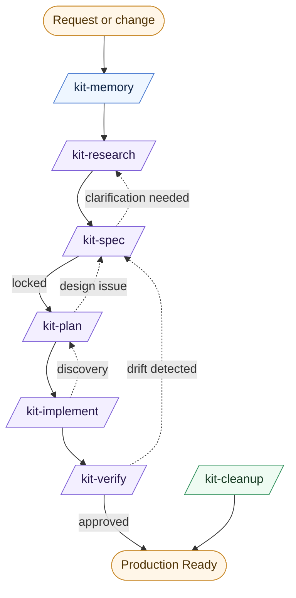

# Core Workflow: The 7-Skill Lifecycle

This guide provides the authoritative map of the AI Agents Development Kit workflow. It covers the 7-skill model, artifact transitions, and common delivery profiles.

---

## 1. Workflow Overview

The kit uses a **Spec-Anchored** model where artifacts are the primary source of truth. The flow is designed to eliminate ambiguity early and prevent drift during execution.

---

## 2. Stage Responsibilities

### 🏗 Foundation
*   **`/kit-memory`**: Manages the **Constitution** (Rules) and **Knowledge Base** (Facts). Handles the promotion of feature findings into global memory.

### 🚀 Feature Delivery
*   **`/kit-research`**: Investigates current behavior and traces bugs. Produces `analysis.md`.
*   **`/kit-spec`**: Defines "What & Why" using a **Socratic Wave**. Produces `spec.md` and runs a built-in readiness review (`requirements-review.md`).
*   **`/kit-plan`**: Designs the technical approach (`design.md`) and decomposes work into bounded units (`tasks.md`) with **Automated Traceability**.
*   **`/kit-implement`**: Executes tasks one at a time. Mark tasks `Done` only after fresh validation evidence is provided.
*   **`/kit-verify`**: Audits the implementation. Enforces the **Spec-Drift Guardian** to ensure the code matches the specification.

### 🧹 Maintenance
*   **`/kit-cleanup`**: Performs surgical refactoring and debt removal without changing behavior.

---

## 3. Artifact Lifecycle

| Artifact | Purpose | Role in Workflow |
| :--- | :--- | :--- |
| **`analysis.md`** | Evidence-based discovery. | Reduces uncertainty before specification. |
| **`spec.md`** | Functional requirements. | The **Source of Truth** for the feature. |
| **`design.md`** | Technical decisions. | Resolves architectural ambiguity. |
| **`plan.md`** | Execution strategy. | Defines sequencing and rollout phases. |
| **`tasks.md`** | Atomic work units. | Tracks progress and validation evidence. |
| **`review.md`** | Verification audit. | Durable record of requirement coverage. |

---

## 4. Delivery Profiles (Adaptive Rigor)

Not every change needs the full 7-skill path. Choose the profile that matches your risk level.

| Profile | Flow | Use Case |
| :--- | :--- | :--- |
| **Standard** | Research → Spec → Plan → Implement → Verify | Most new features or complex changes. |
| **Fast-Track** | Spec → Implement → Verify | Minor updates or established patterns. |
| **Hotfix** | Research → Implement → Verify | Urgent bug fixes where the spec is the bug report. |

---

## 5. Use-Case Loops (Scenarios)

### A. New Feature Scenario
Building a feature that doesn't exist yet and affects multiple systems.
**Path:** `kit-research` → `kit-spec` → `kit-plan` → `kit-implement` → `kit-verify`.

### B. Brownfield Feature Scenario
Adding to or improving an existing feature area with established patterns.
**Path:** `kit-research` → `kit-spec` → `kit-plan` (optional) → `kit-implement` → `kit-verify`.

### C. Bug Fix Scenario
Fixing a defect with clear reproduction steps.
**Path:** `kit-research` (Root Cause) → `kit-spec` (Repair Scope) → `kit-implement` → `kit-verify`.

### D. Tiny Change Scenario
Low-risk changes: typo fixes, config tweaks, or simple style improvements.
**Path:** `kit-spec` → `kit-implement`.

---

## 6. Common Feedback Loops

*   **"Discovery" Loop:** Implementation reveals a technical hurdle. **Action:** Return to `/kit-plan` to adjust design or tasks.
*   **"Clarification" Loop:** Planning reveals a requirement gap. **Action:** Return to `/kit-spec` to update the specification.
*   **"Drift" Loop:** Verification finds code that isn't in the spec. **Action:** Either remove the code or update the spec using `/kit-spec`.

---

## 6. The Quality Bar

The workflow is successful when:
1.  **Downstream stages do not "invent" requirements.** (They follow the Spec).
2.  **Implementation is evidence-based.** (Tests/Logs prove the change).
3.  **Traceability is intact.** (`REQ -> TASK -> TEST`).
4.  **Zero Drift exists.** (Spec and Code are in sync).
