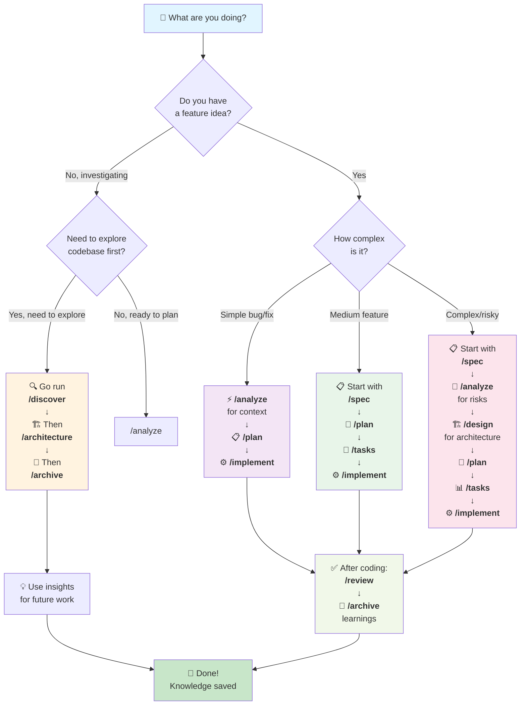

# Command Discovery: What Should I Run?

This flowchart helps you choose the right command for your exact situation.



---

## Quick Decision Matrix

| Situation | First Command | Then | Then | Finally |
|-----------|---|---|---|---|
| **Simple bug fix** | `/analyze` | `/plan` | `/implement` | `/review` → `/archive` |
| **Medium feature** | `/spec` | `/plan` | `/implement` | `/review` → `/archive` |
| **Complex feature** | `/spec` | `/analyze` | `/design` | `/plan` → `/tasks` → `/implement` → `/review` → `/archive` |
| **Need approval first** | `/spec` | `/requirement-review` | `/plan` (if approved) | Proceed normally |
| **Explore codebase** | `/discover` | `/architecture` | (Feature work) | `/archive` |
| **Project startup** | `/constitution` | `/patterns` | (Ready for `/spec`) | — |

---

## Command Descriptions

### 📋 **`/spec`** — Define what to build
**Use when**: Starting a new feature or bug fix  
**Duration**: 45-90 min  
**Output**: Feature requirements & acceptance criteria  
**Next**: `/design` (if complex) or `/plan` (if simple)

### 🔍 **`/analyze`** — Investigate & research
**Use when**: Need to understand problem first or risks  
**Duration**: 30 min to 2 hours  
**Output**: Investigation findings & options  
**Next**: `/spec` (if new feature) or `/plan` (if bug fix)

### 🏗️ **`/design`** — Technical design
**Use when**: Complex feature needs architecture review  
**Duration**: 1-8 hours  
**Output**: Design options, decisions, trade-offs  
**Next**: `/plan`

### 📝 **`/plan`** — Implementation strategy
**Use when**: Ready to sequence the work  
**Duration**: 1-2 hours  
**Output**: Phases, timeline, risks, rollout  
**Next**: `/tasks`

### 📊 **`/tasks`** — Break into trackable items
**Use when**: Ready to start execution  
**Duration**: 1-2 hours  
**Output**: TASK-001, TASK-002... with clear acceptance  
**Next**: `/implement`

### ⚙️ **`/implement`** — Write code
**Use when**: Tasks defined, ready to code  
**Duration**: 2-4 hours per task  
**Output**: Code + tests + commit messages  
**Next**: `/review` (after all code)

### ✅ **`/review`** — Verify completion
**Use when**: Feature complete, tests passing  
**Duration**: 30-60 min  
**Output**: Approval or feedback  
**Next**: `/archive` (if approved)

### 📋 **`/requirement-review`** — Review spec
**Use when**: Spec needs approval before proceeding  
**Duration**: 15-30 min  
**Output**: Review feedback  
**Next**: Revise or proceed per feedback

### 🏛️ **`/constitution`** — Define project principles
**Use when**: Project startup (one-time)  
**Duration**: 15-30 min  
**Output**: Project rules, standards, team agreements  
**Next**: `/patterns`

### 🔧 **`/patterns`** — Build patterns library
**Use when**: After constitution (one-time setup)  
**Duration**: 15-30 min  
**Output**: Reusable patterns & conventions  
**Next**: Ready for feature work

### 🔍 **`/discover`** — Explore existing codebase
**Use when**: Working with unfamiliar system  
**Duration**: 20-30 min  
**Output**: Investigation of existing structure  
**Next**: `/architecture`

### 🏗️ **`/architecture`** — Document system design
**Use when**: Need to understand existing architecture  
**Duration**: 20-30 min  
**Output**: Architecture documentation  
**Next**: `/archive` (save and reference)

### 💾 **`/archive`** — Save learnings
**Use when**: Feature shipped or significant learning  
**Duration**: 15-30 min  
**Output**: Updated project memory  
**Benefit**: Knowledge persists for future features

---

## Real Examples

### Example 1: Simple Bug (30 min)
```
You: "There's a bug in the login flow"
→ Run: /analyze "what's happening with login?"
→ Run: /plan "how to fix it?"
→ Run: /implement "code the fix"
→ Run: /review "verify it's fixed"
→ Run: /archive "save what we learned"
```

### Example 2: Medium Feature (4 hours)
```
You: "We need user profiles"
→ Run: /spec "define user profile requirements"
→ Run: /plan "how to implement profiles?"
→ Run: /tasks "break into tasks"
→ Run: /implement "code the feature"
→ Run: /review "verify user profiles work"
→ Run: /archive "save patterns we created"
```

### Example 3: Complex Feature (8 hours)
```
You: "We need real-time collaboration"
→ Run: /spec "define collaboration requirements"
→ Run: /analyze "research real-time approaches"
→ Run: /design "architecture decision for real-time"
→ Run: /plan "implementation timeline"
→ Run: /tasks "break into parallel tasks"
→ Run: /implement "code the feature"
→ Run: /review "verify it works"
→ Run: /archive "save architecture decision & patterns"
```

### Example 4: Exploring New Codebase (1 hour)
```
You: "I'm new, need to understand the system"
→ Run: /discover "explore the codebase"
→ Run: /architecture "document what I found"
→ Run: /archive "save my notes"
→ Now: Read saved architecture, then run /spec for features
```

---

## Decision Tips

1. **When in doubt about command order?** → Look at the Examples above
2. **Need to check something?** → Use `/analyze` to investigate first
3. **Feature is too complex?** → Add `/design` step
4. **Unsure if feature is finished?** → Run `/review` to verify
5. **Want to remember this for next time?** → Run `/archive` to save
6. **Starting new project?** → Begin with `/constitution` and `/patterns`

---

## Next Steps

1. Choose your situation above
2. Run the first command suggested
3. Follow the chain to completion
4. Always end with `/archive` to save learnings

**Ready?** Pick your situation and run: `/[command] "your task"`
