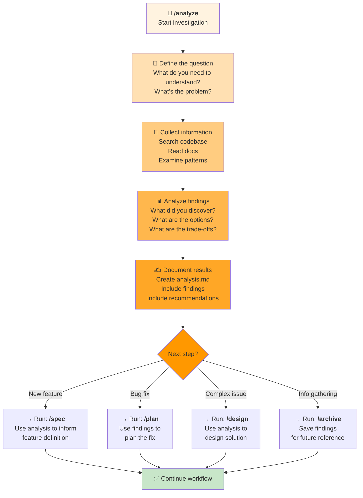

# `/analyze` Workflow: Investigating & Research

Use this when you need to **understand a problem first** before building a solution.



---

## When to Use `/analyze`

**Use when you have questions like:**
- "What's causing this bug?"
- "How does this feature currently work?"
- "What are our options for implementing this?"
- "Is this risky? What are the gotchas?"
- "How is this similar to what we've done before?"
- "What's the best approach here?"

**Typical duration:** 30 minutes to 2 hours

---

## The Analysis Steps

### Step 1: Define the Question
**What are you investigating?**
- Frame the problem clearly
- Identify what you need to understand
- List your specific questions

**Agent helps by:**
- Clarifying ambiguous questions
- Suggesting related areas to investigate
- Breaking down complex questions

### Step 2: Collect Information
**Where to look:**
- Read relevant code files
- Review project memory (constitution, patterns, architecture)
- Examine similar features
- Check error logs or bug reports

**Agent helps by:**
- Searching codebase efficiently
- Finding similar patterns
- Extracting key information

### Step 3: Analyze Findings
**What patterns emerge?**
- Summarize what you discovered
- Identify options or approaches
- List pros and cons
- Flag risks or gotchas

**Agent helps by:**
- Synthesizing complex information
- Comparing approaches
- Identifying trade-offs

### Step 4: Document Results
**Capture your findings:**
- Key findings and insights
- Options you've identified
- Recommendations for next steps
- Questions for follow-up

**Agent creates:**
- `analysis.md` with complete findings
- Clear structure for reference later
- Traceability to investigation

---

## Example Analyses

### Example 1: Understanding a Bug
```
Question: "Why is the login flow failing?"

Investigation:
1. Look at error logs
2. Read login controller code
3. Check database schema
4. Review authentication service

Findings:
- Token expiration not handled
- Fallback logic missing
- Similar issue fixed in User profile

Recommendation:
- Add token refresh logic
- Add fallback to retry
- Reuse pattern from User profile

Next: /plan "Implement fix"
```

### Example 2: Feature Approach Decision
```
Question: "What's the best way to add real-time notifications?"

Investigation:
1. Research notification architectures
2. Check existing WebSocket usage
3. Review current event system
4. Examine database capabilities

Findings:
- Option A: WebSocket (real-time, complex)
- Option B: Polling (simple, less real-time)
- We have WebSocket in analytics
- Database supports pub/sub

Recommendation:
- Use WebSocket (we have it working)
- Pattern from analytics is proven
- Cost: moderate complexity

Next: /design "Architecture for notifications"
```

### Example 3: Risk Assessment
```
Question: "Is this feature risky? What could go wrong?"

Investigation:
1. Check similar features in codebase
2. Review performance implications
3. Look at deployment process
4. Check data consistency needs

Findings:
- Database migration needed (risky)
- API versioning required
- Similar feature took 3 days
- High-traffic feature needs caching

Recommendation:
- Plan phased rollout
- Build with feature flags
- Add comprehensive tests
- Monitor closely

Next: /design "Mitigation strategy"
```

---

## After Analysis: What's Next?

**If you discovered:**
- ✅ How to solve it → Move to `/plan`
- ✅ New feature approach → Move to `/spec`
- ✅ Architecture question → Move to `/design`
- ⚠️ Risky approach → Move to `/design` to mitigate
- 📚 Valuable learnings → Move to `/archive` to save

**The analysis informs your next step.**

---

## Tips for Effective Analysis

1. **Be specific** — Narrow questions get better answers
2. **Look at similar patterns** — Reuse what works
3. **Document as you go** — Don't wait until the end
4. **Consider trade-offs** — Every approach has pros/cons
5. **Flag risks early** — Don't hide gotchas
6. **Ask why** — Go deeper than surface answers
7. **Share findings** — Explain to others for feedback

---

## Common Mistakes to Avoid

❌ **Too broad** — "Analyze the codebase" (too vague)  
✅ **Better** — "Analyze how authentication currently works and what we need for OAuth"

❌ **Analysis paralysis** — Investigating forever without conclusion  
✅ **Better** — Set a time limit, then move to next step

❌ **Not documenting** — Keeping findings in your head  
✅ **Better** — Write findings in analysis.md immediately

❌ **Forgetting context** — Not reviewing project memory first  
✅ **Better** — Read constitution.md and patterns before analyzing

---

## Ready?

```
Run: /analyze "Your investigation question"
```

**Example:**
```
/analyze "How does the current payment system work and what would we need for credit vaults?"
```

The agent will create `analysis.md` with complete investigation findings.

After analysis, pick your next step:
- `/spec` if you're defining a new feature
- `/plan` if you're implementing a fix
- `/design` if it's complex
- `/archive` if it's important knowledge
