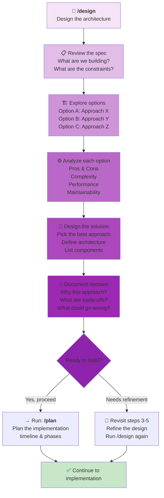

# `/design` Workflow: Technical Architecture

Use this when you have a **complex feature** that needs **architecture decisions** before building.



---

## When to Use `/design`

**Use when you have questions like:**
- "How should we architect this feature?"
- "Should we use approach A or approach B?"
- "How do we integrate this with existing systems?"
- "What are the data flow implications?"
- "How do we handle performance at scale?"
- "What are the failure modes?"

**Typical duration:** 1-8 hours (depends on complexity)

---

## The Design Steps

### Step 1: Review the Specification
**What are we building?**
- Read the feature spec
- Understand requirements
- Identify constraints
- Note performance targets

**Agent helps by:**
- Clarifying requirements
- Identifying missing constraints
- Suggesting architectural concerns

### Step 2: Explore Options
**What approaches could work?**
- Generate 2-3 different approaches
- Consider existing patterns in codebase
- Look at how similar features are built
- Consider trade-offs early

**Agent helps by:**
- Finding similar patterns in codebase
- Suggesting proven approaches
- Identifying architectural options

### Step 3: Analyze Each Option
**Evaluate the approaches:**
- Pros and cons of each
- Complexity to implement
- Performance implications
- Maintenance burden
- Risk factors

**Agent helps by:**
- Weighing trade-offs
- Identifying risks
- Estimating complexity

### Step 4: Design the Solution
**Create the architecture:**
- Pick the best approach
- Define components
- Show data flow
- List integrations needed
- Define APIs/interfaces

**Agent creates:**
- Architecture diagrams
- Component descriptions
- Data flow documentation
- API specifications

### Step 5: Document the Decision
**Capture why you chose this:**
- Architecture decision (what)
- Why this approach (rationale)
- Trade-offs accepted
- Risks identified
- Fallback plans

**Agent creates:**
- `design.md` with complete decision record
- Trade-off analysis
- Risk mitigation strategies
- Implementation guidelines

---

## Example Designs

### Example 1: Real-Time Notifications
```
Spec: Support real-time notifications for user actions

Options:
A) WebSocket (real-time, more complex)
B) Server-Sent Events (simpler, unidirectional)
C) Polling (simple, less responsive)

Analysis:
A: Pro (real-time), Con (complex connection management)
B: Pro (simpler), Con (browser limitations)
C: Pro (simple), Con (latency, server load)

Decision: WebSocket
Reason: We already use it in analytics (proven pattern)
Trade-off: More complexity in DevOps monitoring
Risk: Connection drops need retry logic
Mitigation: Implement exponential backoff + local queue

Design:
- WebSocket server on separate port
- Message queue for offline handling
- Graceful degradation to polling
- Health checks every 30 seconds
```

### Example 2: Multi-Tenant Data Isolation
```
Spec: Support multiple independent organizations in one system

Options:
A) Separate databases per tenant
B) Shared database with tenant_id column
C) Hybrid (shared DB + encrypted data)

Analysis:
A: Pro (isolation), Con (operational complexity)
B: Pro (simpler), Con (isolation risk, query complexity)
C: Pro (balance), Con (performance overhead)

Decision: Option B (shared database with tenant_id)
Reason: Our current DevOps can't manage 100+ databases
Trade-off: Requires careful query design, more testing
Risk: Query bugs could leak data
Mitigation: Tenant_id in every query (enforced at ORM)
            Audit logging on sensitive data
            Integration tests for isolation
```

### Example 3: Payment Processing
```
Spec: Accept payments with fraud detection

Options:
A) Stripe (out-of-box, fees)
B) Custom (flexible, complex)
C) Hybrid (custom interface, Stripe backend)

Analysis:
A: Pro (simple, PCI compliance), Con (cost, lock-in)
B: Pro (flexible), Con (PCI requirements, complexity)
C: Pro (flexibility + compliance), Con (moderate complexity)

Decision: Hybrid with Stripe backend
Reason: Compliance handled by Stripe, our abstraction layer
Trade-off: Extra abstraction layer, Stripe fees
Risk: Stripe outage affects payments
Mitigation: Payment queuing system, retry logic
            Clear customer messaging
            Monitoring & alerting
```

---

## After Design: What's Next?

**Once you have the design:**
1. ✅ Review with team → `/requirement-review`
2. ✅ Ready to implement → `/plan` (plan the phases)
3. ⚠️ Too complex? → Revisit and simplify (run `/design` again)
4. 🔄 Needs iteration? → Go back to step 3 (explore more options)

**The design guides your entire implementation.**

---

## Design Principles

1. **Simplify ruthlessly** — Complex designs fail. Choose the simplest approach that works.
2. **Leverage existing patterns** — Don't reinvent. Use what's proven in the codebase.
3. **Plan for failure** — What happens when X breaks? Design resilience in.
4. **Document trade-offs** — Every decision sacrifices something. Be explicit.
5. **Consider future evolution** — How will this scale? How will we maintain it?
6. **Get feedback early** — Show the design to teammates before building.

---

## Common Design Mistakes

❌ **Overengineering** — "What if we need to handle 1 million users?" (when you have 10)  
✅ **Better** — Build for current needs, design for known future growth

❌ **Ignoring existing patterns** — Inventing new solutions instead of reusing  
✅ **Better** — Always check: "How did we solve this before?"

❌ **No fallback plans** — Assuming everything works perfectly  
✅ **Better** — Every design includes: What if this breaks?

❌ **Design in isolation** — Not consulting with teammates  
✅ **Better** — Show design, gather feedback, iterate

❌ **Too abstract** — Design so high-level no one understands implementation  
✅ **Better** — Design specific enough that implementation is clear

---

## Tips for Effective Design

1. **Start with sketches** — Draw data flow, not just words
2. **Use existing patterns** — Leverage proven approaches
3. **Consider the edge cases** — What could go wrong?
4. **Quantify trade-offs** — Not just pros/cons, but impact
5. **Get buy-in early** — Discuss with team before finalizing
6. **Build iteratively** — Design doesn't have to be perfect upfront
7. **Document your thinking** — Why this choice? It helps future you

---

## Ready?

```
Run: /design "Your architecture question"
```

**Example:**
```
/design "We need to handle user file uploads up to 1GB. Design the architecture including virus scanning, storage, and progress tracking."
```

The agent will create `design.md` with:
- Multiple architectural approaches
- Trade-off analysis
- Recommended solution
- Implementation guidelines
- Risk mitigation strategies

After design, run:
- `/plan` to build the implementation timeline
- `/architecture` to document for future reference after implementation
