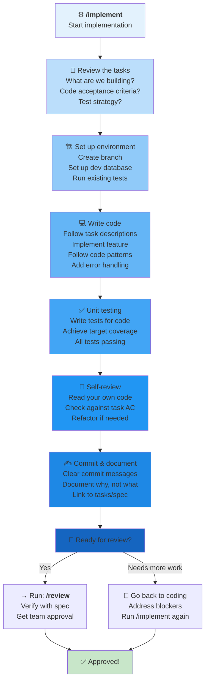

# `/implement` Workflow: Build the Feature

Use this to **write the code** and **execute the implementation**.



---

## When to Use `/implement`

**Use when you:**
- Have tasks to complete (from `/tasks`)
- Have acceptance criteria defined
- Are ready to write code
- Have a test strategy in mind
- Understand what "done" looks like

**Typical duration:** 2-4 hours per task (depends on complexity)

---

## The Implementation Steps

### Step 1: Review the Tasks & Acceptance Criteria
**What exactly are we building?**
- Read the task description
- Understand the acceptance criteria
- Know what inputs/outputs are expected
- Understand the test strategy

**Agent helps by:**
- Clarifying ambiguous requirements
- Highlighting edge cases
- Suggesting implementation approach

### Step 2: Set Up Development Environment
**Get ready to code:**
- Create feature branch (from main)
- Set up dev database with test data
- Run existing tests (to make sure they pass)
- Review project structure

**Agent helps by:**
- Environment troubleshooting
- Branch strategy guidance
- Finding similar code for reference

### Step 3: Write Code
**Implement the feature:**
- Follow existing code patterns
- Implement the feature
- Add error handling
- Add logging for debugging
- Follow code style/linting rules

**Agent helps by:**
- Code generation / boilerplate
- Pattern suggestions
- Debugging issues

### Step 4: Unit Testing
**Verify your code works:**
- Write tests for your code
- Achieve target test coverage (usually 80%+)
- Test edge cases
- All tests passing locally

**Agent helps by:**
- Test generation
- Edge case discovery
- Debugging test failures

### Step 5: Self-Review
**Review your own code:**
- Read your own code (fresh eyes)
- Check vs. task acceptance criteria
- Refactor if needed
- Check for obvious bugs
- Performance OK?

**Agent helps by:**
- Code review prompts
- Identifying potential issues
- Suggesting improvements

### Step 6: Commit with Clear Messages
**Document your work:**
- Clear, descriptive commit messages
- Explain WHY not WHAT (code shows what)
- Link to task/spec if applicable
- One logical change per commit

**Agent helps by:**
- Generating commit messages
- Organizing commits

---

## Example: Implementation Walkthrough

### Task: Add "Archive all read messages" feature

```
Spec: Users can archive all read messages at once
Task: Implement backend API for archiving read messages
Acceptance Criteria:
  - POST /api/message/archive-read
  - Only archives messages marked as read
  - Returns count of archived messages
  - Won't delete messages (soft delete)
  - Must be fast (< 1 second for 10k messages)

Step 1: Review AC
  ✓ Understand: soft delete, filter on "read", return count, performance target

Step 2: Setup environment
  ✓ Branch: feature/archive-read-messages
  ✓ Dev DB: loaded with test messages
  ✓ Tests: All existing tests pass

Step 3: Write code
  - Create MessageController.archiveReadMessages()
  - Query: messages WHERE user_id = ? AND is_read = true AND deleted_at IS NULL
  - Update: SET archived_at = NOW()
  - Add index on (user_id, is_read, deleted_at) for performance
  - Error handling: If DB fails, return 500
  - Logging: Log count archived, user_id, timestamp

Step 4: Unit testing
  - Test: Archive 0 messages (none read) → returns 0
  - Test: Archive 5 messages (5 read) → returns 5
  - Test: Archive doesn't affect unread → returns 5, not 10
  - Test: Archive is fast enough → < 1 second for 10k
  - Test: Archived messages can't be fetched → correctly soft-deleted
  - Coverage: 95% of new code

Step 5: Self-review
  ✓ AC met: filtering on read, return count, soft delete, fast
  ✓ Error handling: DB failure covered
  ✓ Query is optimal: has index, uses WHERE clause not loop
  ✓ Tests comprehensive
  ✓ Code style: matches project patterns

Step 6: Commit
  Message: "Add archive-read-messages endpoint
  
  Allows users to archive all read messages at once.
  Uses soft delete (archived_at timestamp).
  Added index on (user_id, is_read) for performance.
  
  Closes TASK-045"

Ready for /review? YES
```

---

## Code Quality Checklist

### Before Submitting for Review

**Functionality:**
- ✅ Implements all acceptance criteria
- ✅ No console.log() or debug code left
- ✅ Error handling for failures
- ✅ Edge cases considered

**Testing:**
- ✅ Unit tests written
- ✅ Target coverage achieved (80%+)
- ✅ Tests pass locally
- ✅ Integration tests (if needed)

**Code Quality:**
- ✅ Follows project patterns
- ✅ Linting passes (no warnings)
- ✅ No commented-out code
- ✅ Functions are reasonably sized
- ✅ Variable names are clear
- ✅ Comments explain WHY not WHAT

**Performance:**
- ✅ No obvious inefficiencies
- ✅ Database queries optimized
- ✅ No N+1 queries
- ✅ Meets performance targets (if specified)

**Security:**
- ✅ Input validation
- ✅ SQL injection protected (use parameterized queries)
- ✅ Authorization checks (can user do this?)
- ✅ No secrets in code

**Documentation:**
- ✅ Clear commit message
- ✅ API documented (if external)
- ✅ Linked to task/spec

---

## Implementation Patterns from Your Project

**Your project likely has patterns:**
- How to create models
- How to write API endpoints
- How to handle errors
- How to organize tests
- How to organize components

**Agent will:**
- Point you to similar features
- Show patterns from existing code
- Help you follow conventions

---

## Common Implementation Issues

❌ **Scope creep** — Task says X, you implement X+Y+Z  
✅ **Better** — Implement exactly what task requires, create new task for extras

❌ **Insufficient testing** — "Tests are boring, just test happy path"  
✅ **Better** — Test happy path + 3-4 critical failure cases

❌ **Performance ignored** — "It works, that's enough"  
✅ **Better** — Check performance targets, optimize if needed

❌ **No error handling** — Works when everything's perfect  
✅ **Better** — Plan for: network failures, DB errors, bad input

❌ **Comments replace clarity** — Code needs comments to understand  
✅ **Better** — Code is clear, comments explain WHY

---

## Tips for Productive Implementation

1. **Start small** — Get hello-world working first
2. **Commit frequently** — One logical change per commit
3. **Test as you go** — Don't write all code then test
4. **Reference similar code** — Patterns already in your codebase
5. **Read error messages carefully** — They often tell you exactly what's wrong
6. **Ask for help early** — If stuck 30 min, ask (don't spin 2 hours)
7. **Take breaks** — Fresh eyes catch bugs faster

---

## After Implementation: What's Next?

**Once coding is done:**
1. ✅ Task acceptance criteria met → `/review`
2. ✅ All tests passing → `/review`
3. ⚠️ Incomplete or broken → Go back to Step 3 (more coding)
4. 📝 Next task ready → Run `/implement` again

**The review step verifies against spec.**

---

## Ready?

```
Run: /implement "Your task description"
```

**The agent will:**
- Help set up environment
- Generate boilerplate code
- Suggest patterns from existing code
- Help with debugging
- Guide you through testing

**Example:**
```
/implement "TASK-045: Backend API for archiving read messages. POST /api/message/archive-read. Must soft-delete only read messages, return count, complete in <1 second for 10k messages."
```

After implementation, run:
- `/review` to verify it meets spec
- Then `/archive` to save learnings after it's merged
