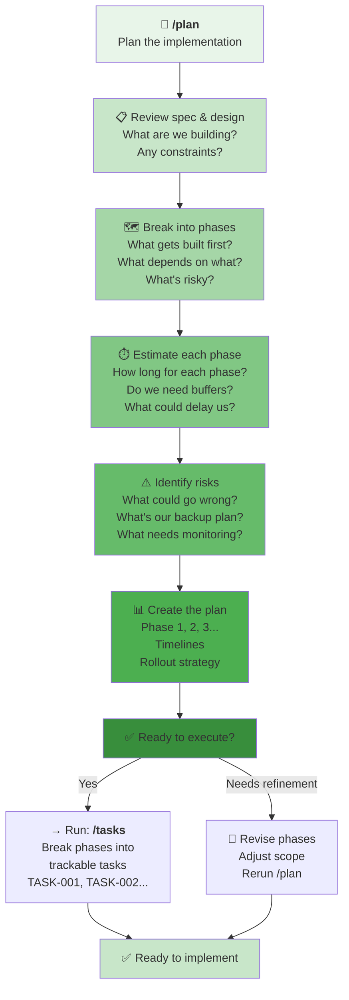

# `/plan` Workflow: Implementation Strategy

Use this when you're ready to **organize the work** and **sequence the implementation**.



---

## When to Use `/plan`

**Use when you have questions like:**
- "What's the best way to sequence this work?"
- "How long will this take?"
- "What are the phases/milestones?"
- "What are the risks?"
- "How do we roll this out safely?"
- "What should we do first?"

**Typical duration:** 1-2 hours

---

## The Planning Steps

### Step 1: Review Specification & Design
**What are we building?**
- Reread the feature spec
- Review the architecture design (if complex)
- Understand all requirements
- Identify any constraints

**Agent helps by:**
- Summarizing key points
- Highlighting critical requirements
- Flagging integration points

### Step 2: Break Into Phases
**How do you sequence the work?**
- Identify logical phases
- What's built in phase 1?
- What depends on phase 1 before starting?
- Consider: MVP first, then enhancements

**Agent helps by:**
- Finding natural breaking points
- Suggesting phased approaches
- Identifying dependencies

### Step 3: Estimate Each Phase
**How long will each take?**
- Estimate effort for each phase
- Factor in testing/review time
- Include buffer time
- Consider team capacity

**Agent helps by:**
- Benchmarking against similar features
- Breaking down complex estimates
- Identifying time sinks

### Step 4: Identify Risks
**What could go wrong?**
- Technical risks (performance, integration)
- Operational risks (deployment)
- Resource risks (team availability)
- External risks (dependencies, approvals)

**Agent helps by:**
- Mining your project history
- Suggesting common gotchas
- Creating mitigation strategies

### Step 5: Create the Plan
**Document the strategy:**
- Phases with timelines
- Dependencies and sequencing
- Rollout/deployment approach
- Contingency plans
- Success metrics/acceptance

**Agent creates:**
- `plan.md` with complete implementation plan
- Phase breakdown with timelines
- Risk mitigation strategies
- Rollout/deployment guide

---

## Example Plans

### Example 1: Simple Feature (2 days)
```
Feature: Add dark mode toggle

Spec: Users can toggle dark mode, preference persists

Phases:
Phase 1: UI & Toggle (4 hours)
  - Add dark mode CSS
  - Add toggle button
  - Store preference in localStorage
  - Acceptance: Toggle works, persists on refresh

Phase 2: Testing & Polish (2 hours)
  - Test across browsers
  - Refine colors
  - Review with design

Phase 3: Deploy (30 min)
  - Deploy to production
  - Monitor for issues

Timeline: 2 days total
Risks: Low (isolated feature, no backend)
```

### Example 2: Medium Feature (1 week)
```
Feature: Add team workspace support

Spec: Users manage multiple teams, switch between them

Phases:
Phase 1: Data Model & Migrations (1 day)
  - Add Team table
  - Add team_id to User, Project
  - Create migration
  - Acceptance: Data layer ready

Phase 2: Backend APIs (2 days)
  - TeamController endpoints
  - Authorization checks
  - Acceptance: API tests pass

Phase 3: Frontend Workspace Switcher (1.5 days)
  - UI for team list
  - Switch context
  - Redirect to user's team
  - Acceptance: Can switch teams

Phase 4: Integration & Testing (1.5 days)
  - End-to-end tests
  - Edge cases (no teams, permissions)
  - Performance tests

Phase 5: Deploy & Monitor (1 day)
  - Staging test
  - Gradual rollout (10% → 50% → 100%)
  - Monitor errors & performance

Timeline: 1 week total
Risks: Medium (data migration, authorization)
Mitigation: Staging test thoroughly, gradual rollout
```

### Example 3: Complex Feature (2 weeks)
```
Feature: Real-time Collaboration (Google Docs style)

Spec: Multiple users edit simultaneously, see changes in real-time

Phases:
Phase 1: Architecture & Foundation (2 days)
  - WebSocket server setup
  - Client sync library
  - Operational Transform algorithm
  - Acceptance: Can send messages, receive sync

Phase 2: Data Persistence (2 days)
  - Database schema for operations
  - Operation replication
  - Conflict resolution
  - Acceptance: Changes persist, replicate correctly

Phase 3: Frontend Collaboration UI (2 days)
  - Show active users
  - Show user cursors
  - Show user selections
  - Acceptance: Can see who's editing

Phase 4: Real-time Sync (2 days)
  - Live updates in editor
  - Handle network failures
  - Offline queue & retry
  - Acceptance: Real-time updates work

Phase 5: Performance & Optimization (1 day)
  - Optimize network messages
  - Handle 100+ users
  - Acceptance: No lag with many users

Phase 6: Testing & Edge Cases (1.5 days)
  - Simultaneous edits
  - Network failures
  - User disconnections
  - Acceptance: All edge cases handled

Phase 7: Deploy & Monitor (0.5 days)
  - Canary deployment (5% first)
  - Monitor WebSocket connections
  - Monitor error rates
  - Scale as needed

Timeline: 2 weeks total
Risks: High (real-time complexity, performance)
Mitigation:
  - Phase 1 validation (get architecture right first)
  - Load testing before full deploy
  - Gradual rollout with monitoring
  - Fallback: disable real-time if needed
```

---

## Planning Principles

1. **Phases should be independently valuable** — Can we ship it early and get feedback?
2. **Identify critical path** — What's blocking other work?
3. **Start with smallest MVP** — Get something working fast, then expand
4. **Test continuously** — Don't save all testing for the end
5. **Plan for the unknown** — Add 20% buffer for unknowns
6. **Monitor milestones** — Track actual vs. planned progress
7. **Have a rollback plan** — How do we undo this if it breaks?

---

## Thinking About Phases

**Good phase design:**
- ✅ Each phase produces working code
- ✅ Can test each phase independently
- ✅ Clear dependencies between phases
- ✅ Balanced workload
- ✅ Known risks identified

**Bad phase design:**
- ❌ Phases too large (can't ship until all done)
- ❌ Dependencies unclear
- ❌ No testing between phases
- ❌ Unbalanced (1st phase gets 80% of work)
- ❌ No buffer for unknowns

---

## After Planning: What's Next?

**Once you have the plan:**
1. ✅ Team agrees on scope → `/tasks` (break into trackable tasks)
2. ✅ Needs approval → Show plan to stakeholders
3. ⚠️ Scope too large → Reduce scope, re-plan
4. 🔄 Needs iteration → Revisit phases, run `/plan` again

**The plan guides your entire implementation.**

---

## Common Planning Mistakes

❌ **Too big phases** — "Phase 1: Build everything"  
✅ **Better** — "Phase 1: Data model (1 day), Phase 2: Backend (2 days)..."

❌ **No risk mitigation** — Hoping nothing goes wrong  
✅ **Better** — "Risk: Database migration could lock table. Mitigation: Pre-create column, drop constraint..."

❌ **No rollback plan** — What if we need to revert?  
✅ **Better** — "Rollback: Feature flag can disable collaboration, revert code"

❌ **Underestimating testing** — Testing as afterthought  
✅ **Better** — Testing built into each phase, dedicated testing phase at end

❌ **Neglecting DevOps** — Assuming deploy is instant  
✅ **Better** — Budget time for: staging test, canary, monitoring setup

---

## Tips for Realistic Plans

1. **Look at history** — How long did similar features take?
2. **Add contingency** — If you estimate 5 days, plan 6
3. **Parallelize where possible** — What can teams work on simultaneously?
4. **Test early** — Catch problems in phase 1-2, not phase 7
5. **Plan for code review** — Budget time for review & iteration
6. **Document assumptions** — What are we assuming about dependencies?
7. **Review with team** — Get second opinions before committing

---

## Ready?

```
Run: /plan "Your implementation question"
```

**Example:**
```
/plan "We're adding OAuth login integration with Google, GitHub, and Microsoft. Plan the phases and timeline."
```

The agent will create `plan.md` with:
- Detailed phases
- Realistic timelines
- Risk analysis & mitigation
- Rollout strategy
- Dependencies and sequencing

After planning, run:
- `/tasks` to break phases into trackable tasks (TASK-001, TASK-002...)
- `/implement` to start building (following the tasks)
