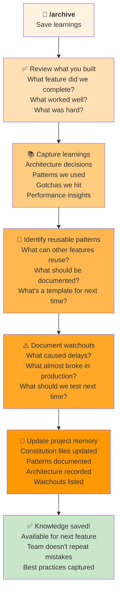

# `/archive` Workflow: Save Learnings & Reflect

Use this to **capture learnings** and **save knowledge** for your team and future projects.



---

## When to Use `/archive`

**Use when:**
- Feature is complete and merged to main
- Major learning or milestone reached
- Architecture decisions finalized
- Patterns emerge that should be documented
- Gotchas discovered that should be noted
- Performance insights gained
- Integration completed and working

**Typical duration:** 15-30 minutes

---

## Why Archive Matters

**Without archiving:**
- Next team repeats the same mistakes
- Architectural decisions are forgotten ("why did we do it this way?")
- Patterns are rediscovered instead of reused
- Performance insights are lost
- Knowledge leaves with team members

**With archiving:**
- Knowledge compounds over time
- Future features go faster (patterns reused)
- Fewer surprises (gotchas documented)
- Better decisions (architecture history available)
- Team onboarding is faster

---

## The Archive Steps

### Step 1: Review What You Built
**What did you accomplish?**
- The feature that shipped
- How it works
- How it integrates
- Performance characteristics
- Who uses it and how

**Agent helps by:**
- Summarizing the feature
- Highlighting key aspects
- Identifying integration points

### Step 2: Capture Learnings
**What did you learn?**
- Architecture decisions made
- Why you chose approach A over B
- Trade-offs you accepted
- What surprised you
- What you'd do differently

**Agent helps by:**
- Prompting for key insights
- Organizing learnings
- Identifying implications

### Step 3: Identify Reusable Patterns
**What should be reused?**
- Code patterns to extract
- Architecture patterns to document
- Best practices from this feature
- Template for future similar work

**Agent helps by:**
- Finding code to extract
- Generalizing patterns
- Suggesting template structure

### Step 4: Document Watchouts
**What should the team know?**
- Mistakes to avoid next time
- Things that almost broke
- Performance gotchas
- Integration nightmares
- Things to test thoroughly

**Agent helps by:**
- Mining your work history
- Identifying critical warnings
- Recording prevention strategies

### Step 5: Update Project Memory
**Capture for the future:**
- Update constitution (team rules/standards)
- Update patterns library (reusable approaches)
- Record architecture decisions
- Document watchouts/gotchas
- Link to similar work

**Agent creates:**
- `constitution.md` updates (team agreed standards)
- `project-knowledge-base.md` updates (patterns)
- `architecture-decisions.md` entries
- `legacy-system-watchouts.md` or similar

---

## Example Archives

### Example 1: Simple Feature Archive
```
Feature: Dark Mode Toggle

Learnings:
- CSS variables easier than theme classes (for future)
- localStorage persists across sessions well
- localStorage can fail silently (wrap in try/catch)

Patterns:
- Use CSS custom properties for themes
- localStorage should have error handling
- Test localStorage persistence explicitly

Watchouts:
- Some users disable localStorage (private browsing)
- CSS custom property browser support gaps in IE
- Dark mode can affect performance (repaints)

Reusable for:
- Any theme-switching feature
- Any localStorage-based persistence
```

### Example 2: Complex Feature Archive
```
Feature: Real-Time Collaboration (Google Docs style)

Learnings:
- Operational Transform is hard to debug
- WebSocket reconnection strategy critical
- Database replication lag caused issues

Patterns:
- WebSocket connection pool with heartbeat
- Offline operation queue + retry logic
- Version numbering for conflict resolution
- How to handle late-arriving updates

Watchouts:
- WebSocket drops without warning (add heartbeat)
- Browser can hold stale connection (max 30s)
- Database replication lag (up to 500ms observed)
- Mobile data can drop connection (retry strategy essential)
- Memory leak: didn't clean up listeners in prod
- Scroll position sync caused UX issues (reverted)

Reusable for:
- Any real-time multi-user feature
- WebSocket implementation patterns
- Conflict resolution strategies
- Offline-first architecture
```

### Example 3: Integration Archive
```
Feature: Stripe Payment Integration

Learnings:
- Webhook delivery order not guaranteed
- Stripe's API versioning prevents breaking changes
- State machine for payment states is essential
- Money calculations need precise decimal handling

Patterns:
- Payment status state machine (pending → succeeded/failed)
- Webhook signature verification (critical for security)
- Idempotency keys for retries
- Currency conversion at charge time

Watchouts:
- Webhook processing order not guaranteed (race condition)
- Test mode and live mode have different behaviors
- Decimal precision: use currency integers (cents)
- PCI compliance: never store card data
- Charge failures can't always be retried
- Refunds have latency (can't refund immediately)

Reusable for:
- Any payment processor integration
- Webhook handling patterns
- Payment state machine design
- Money handling precision
```

---

## What Gets Recorded in Project Memory

### Constitution Updates
**Team standards & agreements:**
- "We use CSS custom properties for theming"
- "All localStorage usage needs error handling"
- "Payment state changes must be logged"

### Architecture Decisions
**How & why decisions were made:**
- "We chose WebSockets over Server-Sent Events because..."
- "We implemented Operation Transform instead of CRDT because..."
- "We use direct database connection instead of API because..."

### Pattern Library
**Reusable patterns across projects:**
- "Theme switching pattern (CSS + localStorage)"
- "Real-time sync pattern (WebSocket + OT)"
- "Payment integration pattern (state machine)"

### Watchouts & Gotchas
**Things to be careful about:**
- "WebSocket: browser holds stale connection for 30s (need heartbeat)"
- "localStorage: can fail in private mode (wrap in try/catch)"
- "Stripe: webhook order not guaranteed (use idempotency)"

### Artifact Locations
**Where to find examples:**
- "Payment state machine: see payment-service.js line 45"
- "Real-time sync: see collaboration-engine.ts"
- "Theme switching: see ThemeContext.tsx"

---

## Reflection Questions

When archiving, ask yourself:

**On the feature:**
- Did it solve the problem?
- Is it maintainable long-term?
- Does the team feel good about it?

**On the architecture:**
- Would you make the same decision again?
- What surprised you?
- What almost broke?

**On the process:**
- What sequence of work was fastest?
- What phases matched estimation?
- What took longer than expected?

**On reusability:**
- What patterns can other features reuse?
- What template could speed up next time?
- What documentation is missing?

**On team knowledge:**
- What should new team members know?
- What gotchas should be documented?
- What integration points are critical?

---

## After Archiving: Continuous Improvement

**Once archived:**
1. ✅ Next feature references archive → Reuses patterns
2. ✅ Team reads watchouts → Avoids mistakes
3. ✅ New team member reads constitution → On-boarded faster
4. ✅ Similar feature built → Uses model from archive

**Knowledge compounds:**
- Feature 1: Learns patterns
- Feature 2: Reuses patterns (faster)
- Feature 3: Reuses patterns + refines (faster + better)
- Feature N: Fast + high-quality (patterns mature)

---

## Archive Best Practices

1. **Archive soon after ship** — While you remember details
2. **Be specific** — "WebSocket dropped unexpectedly at line 45" not "WebSocket was hard"
3. **Link to code** — Show the pattern, don't just describe it
4. **Include why** — "We use state machine because X could happen without it"
5. **Note trade-offs** — "Simpler but slower" or "Complex but flexible"
6. **Capture mistakes** — "We forgot to test offline mode, then it broke in prod"
7. **Update as you learn** — Archive is living document, not final report

---

## Ready?

```
Run: /archive "Your feature description"
```

**The agent will:**
- Extract learnings from your implementation
- Suggest patterns to document
- Create watchout list
- Update project memory
- Create reusable templates

**Example:**
```
/archive "Real-time collaboration feature with WebSocket sync, Operational Transform conflict resolution, offline operation queue. Shipped last week, any gotchas or patterns to record?"
```

The agent will:
1. Ask you about learnings
2. Extract patterns from code
3. Document watchouts
4. Update `project-knowledge-base.md`
5. Save architecture decisions
6. Create template for next real-time feature

---

## Why This Matters

Every feature is an opportunity:
- ✅ To learn (capture learnings)
- ✅ To improve (reuse patterns)
- ✅ To strengthen the team (document knowledge)
- ✅ To accelerate future work (templates ready)

**Archive ensures nothing is wasted.**

Next time someone builds a similar feature, they'll find your patterns, avoid your mistakes, and build even better.

That's how great teams are built.
